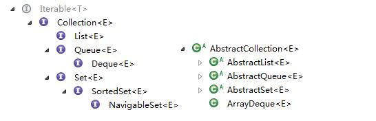

 

# 1. Map
## HashMap,LinkedHashMap,TreeMap的区别

Map主要用于存储健值对，根据键得到值，因此不允许键重复(重复了覆盖了),但允许值重复。

### Hashmap
Hashmap 是一个最常用的Map,它根据键的HashCode 值存储数据,根据键可以直接获取它的值，具有很快的访问速度，遍历时，取得数据的顺序是完全随机的。HashMap最多只允许一条记录的键为Null;允许多条记录的值为 Null;
HashMap不支持线程的同步，即任一时刻可以有多个线程同时写HashMap;可能会导致数据的不一致。如果需要同步，可以用 Collections的synchronizedMap方法使HashMap具有同步的能力，或者使用ConcurrentHashMap。

### Hashtable
Hashtable与 HashMap类似,它继承自Dictionary类，不同的是:它不允许记录的键或者值为空;它支持线程的同步，即任一时刻只有一个线程能写Hashtable,因此也导致了 Hashtable在写入时会比较慢。

### LinkedHashMap
LinkedHashMap保存了记录的插入顺序，在用Iterator遍历LinkedHashMap时，先得到的记录肯定是先插入的.也可以在构造时用带参数，按照应用次数排序。在遍历的时候会比HashMap慢，不过有种情况例外，当HashMap容量很大，实际数据较少时，遍历起来可能会比LinkedHashMap慢，因为LinkedHashMap的遍历速度只和实际数据有关，和容量无关，而HashMap的遍历速度和他的容量有关。

### TreeMap
TreeMap实现SortMap接口，能够把它保存的记录根据键排序,默认是按键值的升序排序，也可以指定排序的比较器，当用Iterator 遍历TreeMap时，得到的记录是排过序的。

一般情况下，我们用的最多的是HashMap,HashMap里面存入的键值对在取出的时候是随机的,它根据键的HashCode值存储数据,根据键可以直接获取它的值，具有很快的访问速度。
在Map 中插入、删除和定位元素，HashMap 是最好的选择。
TreeMap取出来的是排序后的键值对。但如果您要按自然顺序或自定义顺序遍历键，那么TreeMap会更好。
LinkedHashMap 是HashMap的一个子类，如果需要输出的顺序和输入的相同,那么用LinkedHashMap可以实现,它还可以按读取顺序来排列，像连接池中可以应用。

1. HashSet是通过HashMap实现的,TreeSet是通过TreeMap实现的,只不过Set用的只是Map的key
2. Map的key和Set都有一个共同的特性就是集合的唯一性.TreeMap更是多了一个排序的功能.
3. hashCode和equal()是HashMap用的, 因为无需排序所以只需要关注定位和唯一性即可.
   a. hashCode是用来计算hash值的,hash值是用来确定hash表索引的.
   b. hash表中的一个索引处存放的是一张链表, 所以还要通过equal方法循环比较链上的每一个对象才可以真正定位到键值对应的Entry.
   c. put时,如果hash表中没定位到,就在链表前加一个Entry,如果定位到了,则更换Entry中的value,并返回旧value
4. 由于TreeMap需要排序,所以需要一个Comparator为键值进行大小比较.当然也是用Comparator定位的.
   a. Comparator可以在创建TreeMap时指定
   b. 如果创建时没有确定,那么就会使用key.compareTo()方法,这就要求key必须实现Comparable接口.
   c. TreeMap是使用Tree数据结构实现的,所以使用compare接口就可以完成定位了.

 

 

注意： 

1. Collection没有get()方法来取得某个元素。只能通过iterator()遍历元素。 
2. Set和Collection拥有一模一样的接口。 
3. List，可以通过get()方法来一次取出一个元素。使用数字来选择一堆对象中的一个，get(0)...。(add/get) 
4. 一般使用ArrayList。用LinkedList构造堆栈stack、队列queue。 
5. Map用 put(k,v) / get(k)，还可以使用containsKey()/containsValue()来检查其中是否含有某个key/value。 
     HashMap会利用对象的hashCode来快速找到key。 
	 hashing 
          哈希码就是将对象的信息经过一些转变形成一个独一无二的int值，这个值存储在一个array中。 
          我们都知道所有存储结构中，array查找速度是最快的。所以，可以加速查找。 
          发生碰撞时，让array指向多个values。即，数组每个位置上又生成一个梿表。 
6、Map中元素，可以将key序列、value序列单独抽取出来。 
使用keySet()抽取key序列，将map中的所有keys生成一个Set。 
使用values()抽取value序列，将map中的所有values生成一个Collection。 
为什么一个生成Set，一个生成Collection？那是因为，key总是独一无二的，value允许重复。 

## 深入理解 HashMap 加载因子 loadFactor

>	加载因子是表示Hsah表中元素的填满的程度.
	
若:加载因子越大,填满的元素越多,好处是,空间利用率高了,但:冲突的机会加大了.反之,加载因子越小,填满的元素越少,好处是:冲突的机会减小了,但:空间浪费多了.
冲突的机会越大,则查找的成本越高.反之,查找的成本越小.因而,查找时间就越小.

>	因此,必须在 "冲突的机会"与"空间利用率"之间寻找一种平衡与折衷. 这种平衡与折衷本质上是数据结构中有名的"时-空"矛盾的平衡与折衷.

# 2. Set

Set集合特点就是没有重复的内容，其实现是通过map的键来实现的

## 2.1 HashSet
由HashMap实现

## 2.2 LinkedHashSet
由LinkedHashMap实现，LinkedHashMap的特性是其值是有序的，默认是insert顺序

## 2.3 TreeSet
LinkedHashSet只能按照先后顺序来进行排序，TreeSet则是按照比较器给的比较规则进行从小到大排序。其实现也就是借助于TreeMap

## 2.4 EnumSet

# 3. Queue

[Java之集合(一)接口及抽象类](http://www.cnblogs.com/lighten/p/7278655.html "title") 

Queue接口与List、Set同一级别，都是继承了Collection接口。LinkedList实现了Deque接 口。

 

### 1. 没有实现的阻塞接口的LinkedList： 实现了java.util.Queue接口和java.util.AbstractQueue接口
　　内置的不阻塞队列： PriorityQueue 和 ConcurrentLinkedQueue
*	PriorityQueue 和 ConcurrentLinkedQueue 类在 Collection Framework 中加入两个具体集合实现。 
	PriorityQueue 类实质上维护了一个有序列表。加入到 Queue 中的元素根据它们的天然排序（通过其 java.util.Comparable 实现）或者根据传递给构造函数的 java.util.Comparator 实现来定位。
*	ConcurrentLinkedQueue 是基于链接节点的、线程安全的队列。并发访问不需要同步。因为它在队列的尾部添加元素并从头部删除它们，所以只要不需要知道队列的大 小，ConcurrentLinkedQueue 对公共集合的共享访问就可以工作得很好。收集关于队列大小的信息会很慢，需要遍历队列。

### 2. 实现阻塞接口的：
　　java.util.concurrent 中加入了 BlockingQueue 接口和五个阻塞队列类。它实质上就是一种带有一点扭曲的 FIFO 数据结构。不是立即从队列中添加或者删除元素，线程执行操作阻塞，直到有空间或者元素可用。
五个队列所提供的各有不同：
*	ArrayBlockingQueue ：一个由数组支持的有界队列。
*	LinkedBlockingQueue ：一个由链接节点支持的可选有界队列。
*	PriorityBlockingQueue ：一个由优先级堆支持的无界优先级队列。
*	DelayQueue ：一个由优先级堆支持的、基于时间的调度队列。
*	SynchronousQueue ：一个利用 BlockingQueue 接口的简单聚集（rendezvous）机制。

put(), take() 阻塞的方法

方法
*	add        	增加一个元索                    		如果队列已满，则抛出一个IIIegaISlabEepeplian异常
*	remove   	移除并返回队列头部的元素    	如果队列为空，则抛出一个NoSuchElementException异常
*	element  	返回队列头部的元素			如果队列为空，则抛出一个NoSuchElementException异常
*	offer       添加一个元素并返回true       如果队列已满，则返回false
*	poll		移除并返问队列头部的元素    	如果队列为空，则返回null
*	peek       	返回队列头部的元素             		如果队列为空，则返回null
*	put         添加一个元素                      		如果队列满，则阻塞
*	take        移除并返回队列头部的元素     	如果队列为空，则阻塞

#### SynchronousQueue
特别之处在于它内部没有容器，一个生产线程，当它生产产品（即put的时候），如果当前没有人想要消费产品(即当前没有线程执行take)，此生产线程必须阻塞，等待一个消费线程调用take操作，take操作将会唤醒该生产线程，同时消费线程会获取生产线程的产品（即数据传递），这样的一个过程称为一次配对过程(当然也可以先take后put,原理是一样的)
