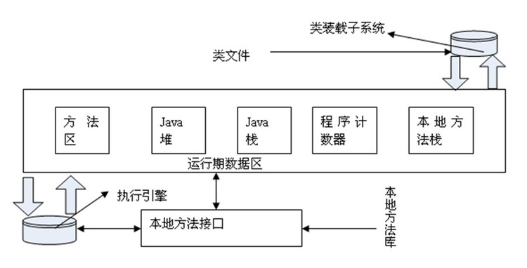
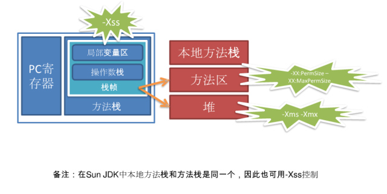
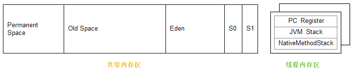

## JVM运行时内存结构

## 判定
在Java中采取了 可达性分析法，基本思想是通过一系列的“GC Roots”对象作为起点进行搜索，如果在“GC Roots”和一个对象之间没有可达路径，则称该对象是不可达的，不过要注意的是被判定为不可达的对象不一定就会成为可回收对象。被判定为不可达的对象要成为可回收对象必须至少经历两次标记过程，如果在这两次标记过程中仍然没有逃脱成为可回收对象的可能性，则基本上就真的成为可回收对象了。

## 典型的垃圾收集算法

1.	Mark-Sweep（标记-清除）算法
2.	Copying（复制）算法
3.	Mark-Compact（标记-整理）算法
4.	Generational Collection（分代收集）算法

分代收集算法是目前大部分JVM的垃圾收集器采用的算法。它的核心思想是根据对象存活的生命周期将内存划分为若干个不同的区域。一般情况下将堆区划分为老年代（Tenured Generation）和新生代（Young Generation），老年代的特点是每次垃圾收集时只有少量对象需要被回收，而新生代的特点是每次垃圾回收时都有大量的对象需要被回收，那么就可以根据不同代的特点采取最适合的收集算法。

目前大部分垃圾收集器对于新生代都采取Copying算法，因为新生代中每次垃圾回收都要回收大部分对象，也就是说需要复制的操作次数较少，但是实际中并不是按照1：1的比例来划分新生代的空间的，一般来说是将新生代划分为一块较大的Eden空间和两块较小的Survivor空间，每次使用Eden空间和其中的一块Survivor空间，当进行回收时，将Eden和Survivor中还存活的对象复制到另一块Survivor空间中，然后清理掉Eden和刚才使用过的Survivor空间。

而由于老年代的特点是每次回收都只回收少量对象，一般使用的是Mark-Compact算法。
注意，在堆区之外还有一个代就是永久代（Permanet Generation），它用来存储class类、常量、方法描述等。对永久代的回收主要回收两部分内容：废弃常量和无用的类。

## 典型的垃圾收集器
垃圾收集算法是 内存回收的理论基础，而垃圾收集器就是内存回收的具体实现

1.	Serial/Serial Old
	Serial/Serial Old收集器是最基本最古老的收集器，它是一个单线程收集器，并且在它进行垃圾收集时，必须暂停所有用户线程。Serial收集器是针对新生代的收集器，采用的是Copying算法，Serial Old收集器是针对老年代的收集器，采用的是Mark-Compact算法。它的优点是实现简单高效，但是缺点是会给用户带来停顿。
2.	ParNew
	ParNew收集器是Serial收集器的多线程版本，使用多个线程进行垃圾收集。
3.	Parallel Scavenge
	Parallel Scavenge收集器是一个新生代的多线程收集器（并行收集器），它在回收期间不需要暂停其他用户线程，其采用的是Copying算法，该收集器与前两个收集器有所不同，它主要是为了达到一个可控的吞吐量。
4.	Parallel Old
	Parallel Old是Parallel Scavenge收集器的老年代版本（并行收集器），使用多线程和Mark-Compact算法。
5.	CMS
	CMS（Current Mark Sweep）收集器是一种以获取最短回收停顿时间为目标的收集器，它是一种并发收集器，采用的是Mark-Sweep算法。
6.	G1
	G1收集器是当今收集器技术发展最前沿的成果，它是一款面向服务端应用的收集器，它能充分利用多CPU、多核环境。因此它是一款并行与并发收集器，并且它能建立可预测的停顿时间模型。

## Java垃圾回收过程

Eden 区：当一个实例被创建了，首先会被存储在堆内存年轻代的 Eden 区中。
Survivor 区（S0 和 S1）：作为年轻代 GC（Minor GC）周期的一部分，存活的对象（仍然被引用的）从 Eden 区被移动到 Survivor 区的 S0 中。类似的，垃圾回收器会扫描 S0 然后将存活的实例移动到 S1 中。
老年代： 老年代（Old or tenured generation）是堆内存中的第二块逻辑区。当垃圾回收器执行 Minor GC 周期时，在 S1 Survivor 区中的存活实例将会被晋升到老年代，而未被引用的对象被标记为回收。
老年代 GC（Major GC）：相对于 Java 垃圾回收过程，老年代是实例生命周期的最后阶段。Major GC 扫描老年代的垃圾回收过程。如果实例不再被引用，那么它们会被标记为回收，否则它们会继续留在老年代中。

内存碎片：一旦实例从堆内存中被删除，其位置就会变空并且可用于未来实例的分配。这些空出的空间将会使整个内存区域碎片化。为了实例的快速分配，需要进行碎片整理。基于垃圾回收器的不同选择，回收的内存区域要么被不停地被整理，要么在一个单独的GC进程中完成。

## GC的执行机制
由于对象进行了分代处理，因此垃圾回收区域、时间也不一样。GC有两种类型：Scavenge GC和Full GC。

### Minor GC/Scavenge GC
一般情况下，当新对象生成，并且在Eden申请空间失败时，就会触发Scavenge GC，对Eden区域进行GC，清除非存活对象，并且把尚且存活的对象移动到Survivor区。然后整理Survivor的两个区。这种方式的GC是对年轻代的Eden区进行，不会影响到年老代。因为大部分对象都是从Eden区开始的，同时Eden区不会分配的很大，所以Eden区的GC会频繁进行。因而，一般在这里需要使用速度快、效率高的算法，使Eden去能尽快空闲出来。

### Major GC/Full GC
对整个堆进行整理，包括Young、Tenured和Perm。Full GC因为需要对整个堆进行回收，所以比Scavenge GC要慢，因此应该尽可能减少Full GC的次数。在对JVM调优的过程中，很大一部分工作就是对于FullGC的调节。有如下原因可能导致Full GC：
1.年老代（Tenured）被写满
2.持久代（Perm）被写满
3.System.gc()被显示调用
4.上一次GC之后Heap的各域分配策略动态变化
