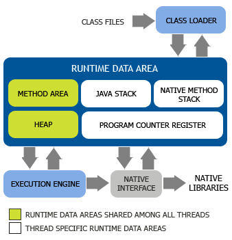
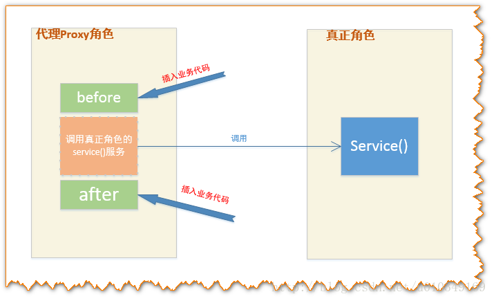
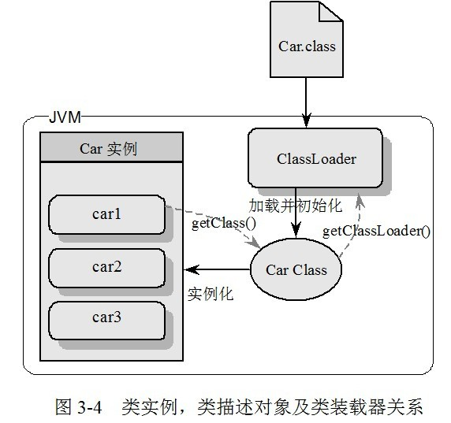

# image to markdown

## apache-common pool.jpg

 

## git核心详解.jpg

 

## java-collecions-interfaces-01.jpg

 

## java-collecions-interfaces-02.jpg

 

## java-collecions-interfaces.png

 

## java-collections-interfaces.jpg

 

## java-concurrent-countdownlanch.png

 

## java-jvm.png

 

## java-memory-runtime.jpg

 

## java-proxy-bytes.png

 

## java-proxy-help.png

 

## java-proxy-invocationhandler-class.jpg

 

## java-proxy-invocationhandler.jpg

 

## java-proxy.jpg

 

## java-queue.png

 

## java-refection-class.jpg

 

## java-threadpool.png

 

## java-throwable.png

 

## java-xml-transform.jpg

 

## java-xml.jpg

 

## jvm-memory-logic.jpg

 

## jvm-memory.jpg

 

## jvm-memory.png

 

## r_sun-jdk-memory-area1.png

 

## tcp-ip-01.jpg

 

## 异常.jpg

 

## 观察者模式.jpg

 

