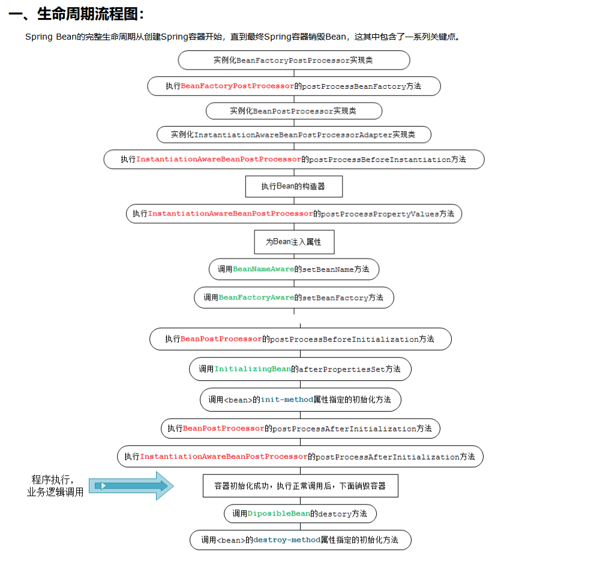

# Spring bean作用域

1.	single	每个spring容器一个实例，不是线程安全
2.	prototype 使用一次创建一次
3.	request	http请求（springmvc）
4.	session	http会话（springmvc）
5.	globalSession

 

# Spring bean生命周期

对象的生命周期：创建（实例化-初始化）-使用-销毁

## 1.BeanFactoyPostProcessor实例化

## 2.Bean实例化

Bean实例化，然后通过某些BeanFactoyPostProcessor来进行依赖注入
Setter注入，执行Bean的属性依赖注入

## 3.BeanPostProcessor

调用Spring内置的BeanPostProcessor负责调用Bean实现的接口: BeanNameAware, BeanFactoryAware, ApplicationContextAware等等
调用完后才会调用自己配置的BeanPostProcessor

## 4.Bean初始化

如果配置有实现BeanPostProcessor的Bean，那么调用它的postProcessBeforeInitialization方法
如果Bean有实现InitializingBean接口那么对这些Bean进行调用
如果Bean配置有init属性，那么调用它属性中设置的方法
如果配置有实现BeanPostProcessor的Bean，那么调用它的postProcessAfterInitialization方法

## 5.Bean销毁阶段

调用DisposableBean接口的destory方法
 调用Bean定义的destory方法

## spring-beans-life.png

 
 
## spring-beans-life-00.png

 

## spring-beans-life-01.png 

 