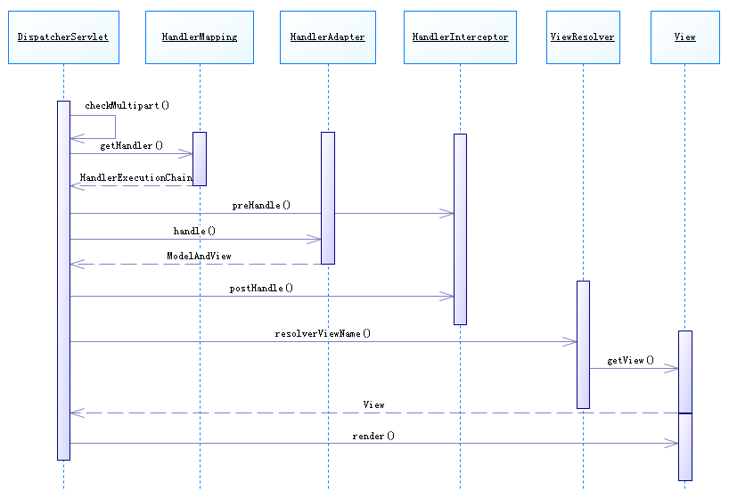

## DispatcherServlet

类图

 

### SpringMVC接口解释
1.	DispatcherServlet接口：
	Spring提供的前端控制器，所有的请求都有经过它来统一分发。在DispatcherServlet将请求分发给Spring Controller之前，需要借助于Spring提供的HandlerMapping定位到具体的Controller。

2.	HandlerMapping接口：
	能够完成客户请求到Controller映射。

>	HandlerExecutionChain

3.	HandlerAdapter:

4.	HandlerInterceptor:

5.	Controller接口：
	需要为并发用户处理上述请求，因此实现Controller接口时，必须保证线程安全并且可重用。
	Controller将处理用户请求，这和Struts Action扮演的角色是一致的。一旦Controller处理完用户请求，则返回ModelAndView对象给DispatcherServlet前端控制器，ModelAndView中包含了模型（Model）和视图（View）。
	从宏观角度考虑，DispatcherServlet是整个Web应用的控制器；从微观考虑，Controller是单个Http请求处理过程中的控制器，而ModelAndView是Http请求过程中返回的模型（Model）和视图（View）。

6.	ViewResolver接口：
	Spring提供的视图解析器（ViewResolver）在Web应用中查找View对象，从而将相应结果渲染给客户。

7. View

 

# WebApplicationContext

1.	servlet 容器
2.	ContextLoaderlistener
3.	ContextLoader
4.	XmlWebApplicationContext
5.	ServletContext

 

 