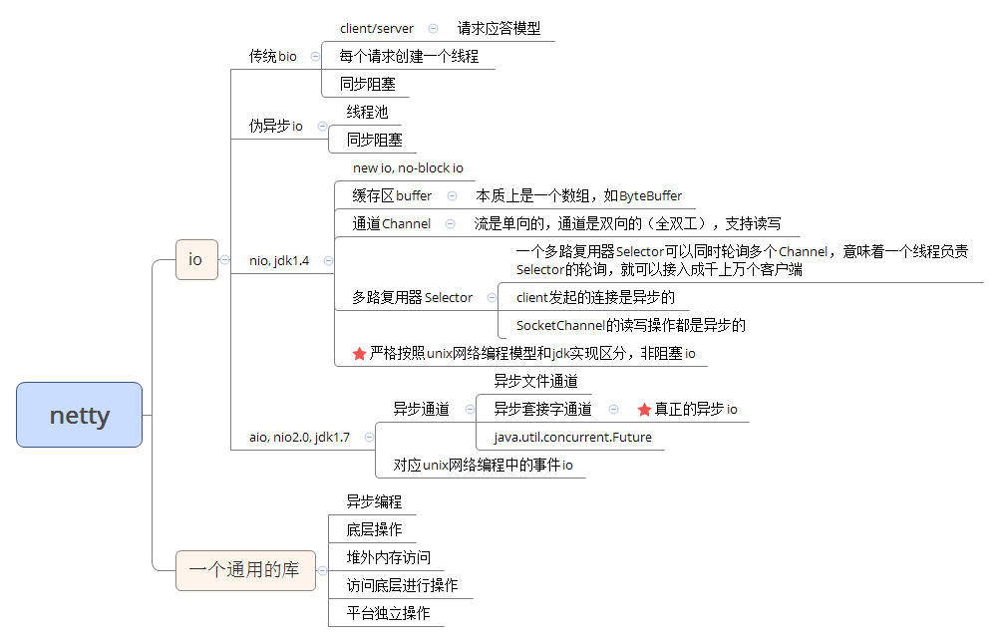

Netty提供异步的、事件驱动的网络应用程序框架和工具，用以快速开发高性能、高可靠性的网络服务器和客户端程序。

## 优点
1.	并发高 	NIO
2.	传输快	零拷贝, ByteBuf
3.	封装好

## 概要

 

## 组成

 

## 基础概念

### NioSocketChannel	
Connect方法向服务端发起TCP链接

### NioServerSocketChannel	
listen, bind ip + port

### Channel与socket的关系
Channel是对socket的装饰或者门面，其封装了对socket的原子操作

### EventLoopGroup
Reactor线程模型。在netty中每个EventLoopGroup本身是一个线程池，其中包含了自定义个数的NioEventLoop,每个NioEventLoop是一个线程，并且每个NioEventLoop里面持有自己的selector选择器。

在Netty中客户端持有一个EventLoopGroup用来处理网络IO操作，在服务器端持有两个EventLoopGroup，其中boss组是专门用来接收客户端发来的TCP链接请求的，worker组是专门用来具体处理完成三次握手的链接套接字的网络IO请求的。

### Channel 与 EventLoop 的关系
Netty中NioEventLoop是EventLoop的一个实现，每个NioEventLoop中会管理自己的一个selector选择器和监控选择器就绪事件的线程；每个Channel只会关联一个NioEventLoop；

当Channel是客户端通道NioSocketChannel时候，会注册NioSocketChannel管理的SocketChannel实例到自己关联的NioEventLoop的selector选择器上，然后NioEventLoop对应的线程会通过select命令监控感兴趣的网络读写事件；

当Channel是服务端通道NioServerSocketChannel时候，NioServerSocketChannel本身会被注册到boss EventLoopGroup里面的某一个NioEventLoop管理的selector选择器上，而完成三次握手的链接套接字是被注册到了worker EventLoopGroup里面的某一个NioEventLoop管理的selector选择器上；

需要注意是多个Channel可以注册到同一个NioEventLoop管理的selector选择器上，这时候NioEventLoop对应的单个线程就可以处理多个Channel的就绪事件；但是每个Channel只能注册到一个固定的NioEventLoop管理的selector选择器上。

### ChannelPipeline
Netty中的ChannelPipeline类似于Tomcat容器中的Filter链，属于设计模式中的责任链模式，其中链上的每个节点就是一个ChannelHandler。在netty中每个Channel有属于自己的ChannelPipeline，对从Channel中读取或者要写入Channel中的数据进行依次处理

