# image to markdown

## redis-app1.jpg

 

## redis-app2.jpg

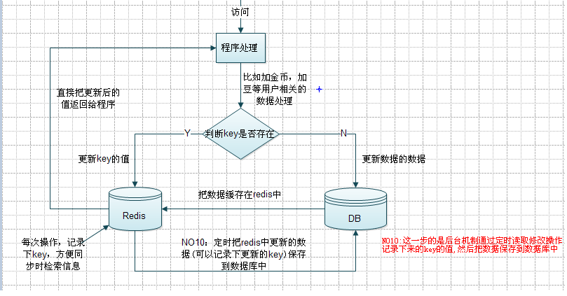 

## spring-beanfactory-init.png

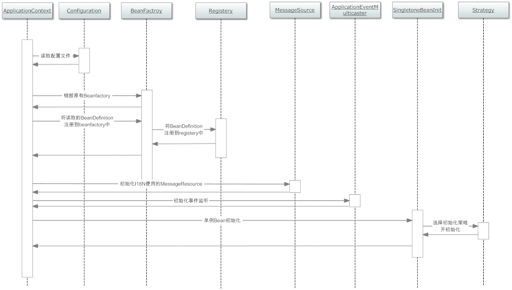 

## spring-beanfactory.png

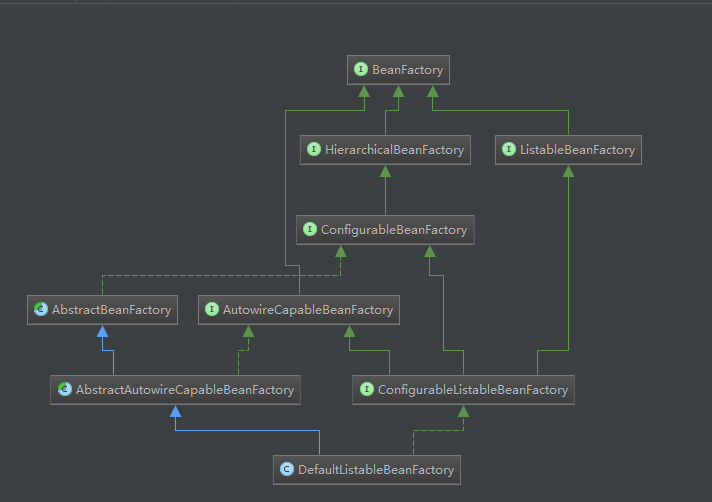 

## spring-beans-life-00.png

 

## spring-beans-life-01.png

 

## spring-beans-life.png

 

## spring-beans-parser.png

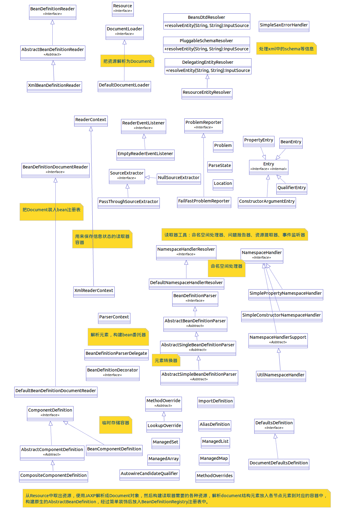 

## spring-cache-el.jpg

 

## spring-core-context-beans.png

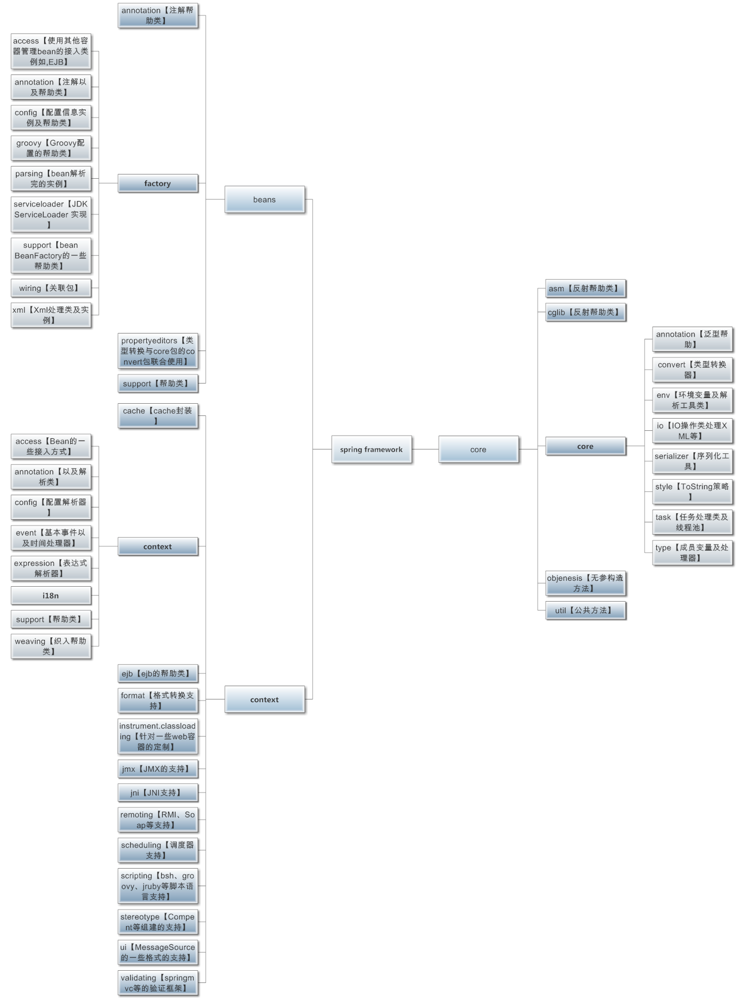 

## spring-core-jar.png

 

## spring-core.png

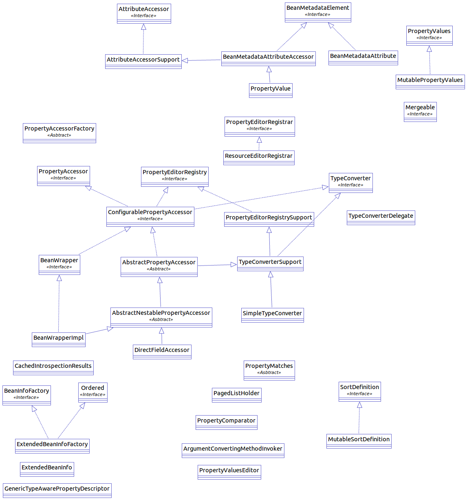 

## spring-data-repository.jpg

 

## spring-data.jpg

 

## spring-jars-dependency.jpg

 

## spring-jars.jpg

 

## spring.png

 

## springaop-cache.png

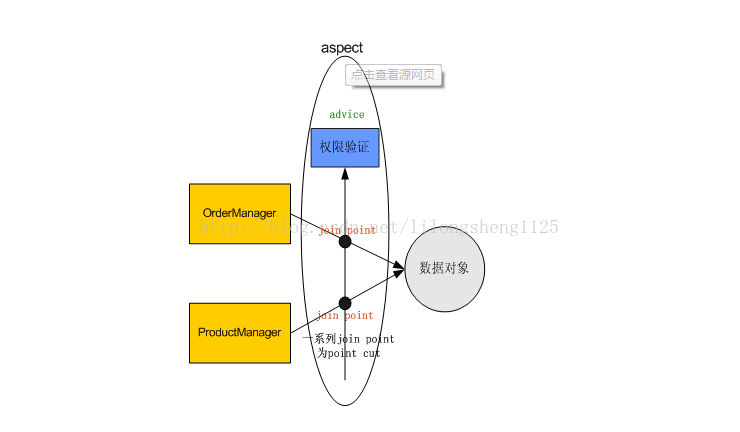 

## springmvc-data-transform.PNG

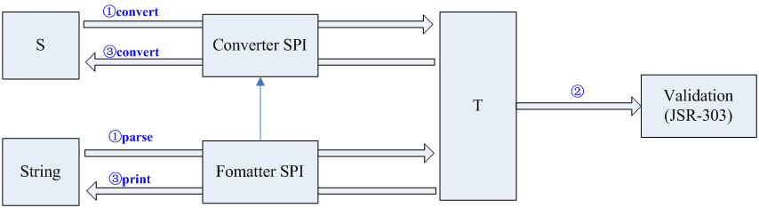 

## springmvc-dispatcherservlet-dodispatch.png

 

## springmvc-dispatcherservlet-init.png

 

## springmvc-dispatcherservlet-view-render.png

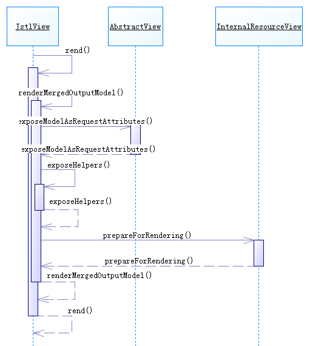 

## springmvc-dispatcherservlet.png

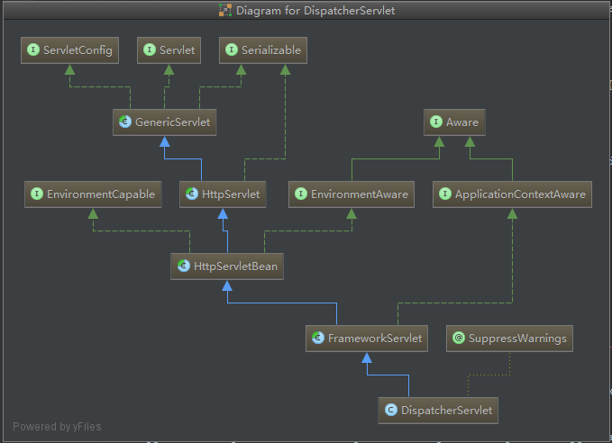 

## springmvc-http-message-converter.png

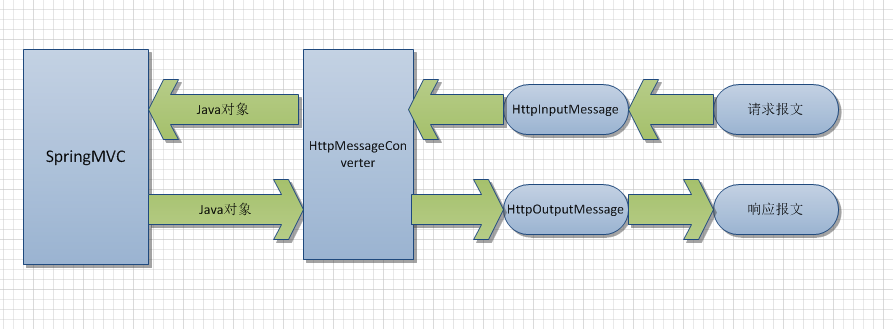 

## springmvc.JPG

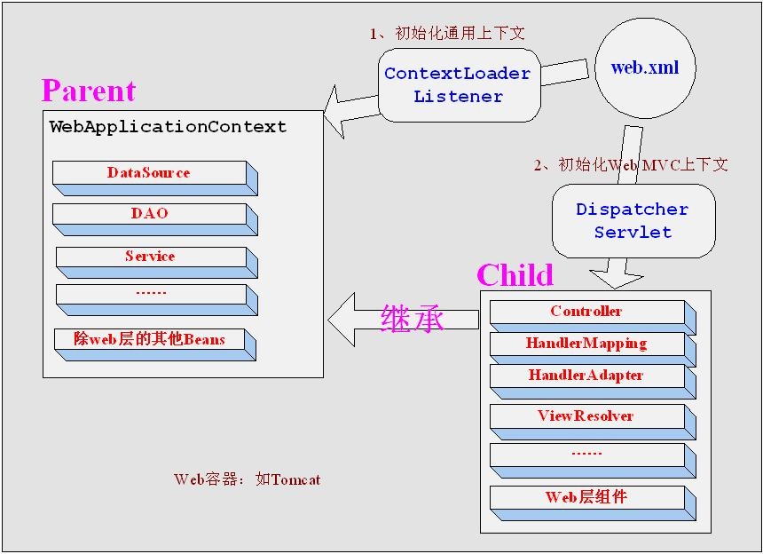 

## 多个拦截器执行顺序.png

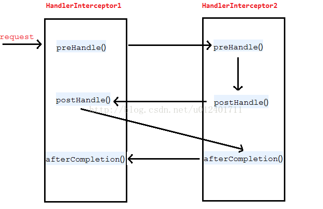 

