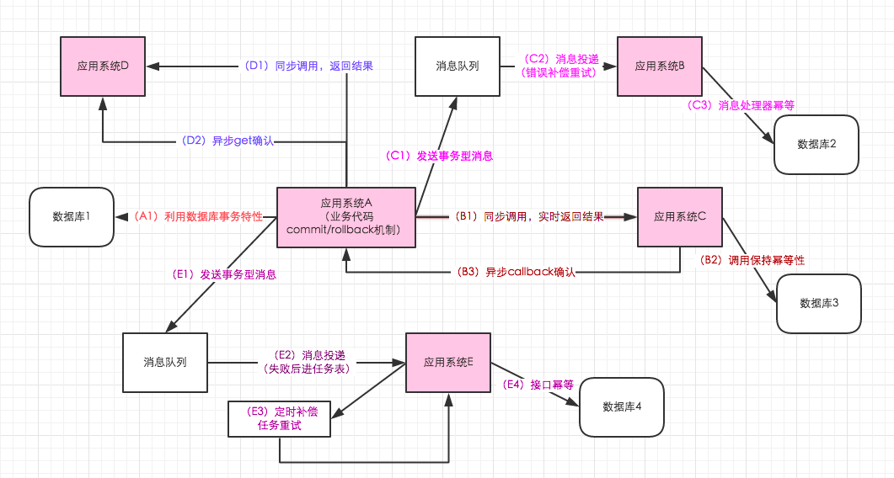

事实上，最终一致性并不是只有那些大型分布式系统才涉及的特性，许多现代的关系型数据库都采用了最终一致性模型。在现代关系型数据库中（比如MySQL和PostgreSQL），大多都会采用同步或异步方式来实现主备数据复制技术。在同步方式中，数据的复制过程通常是更新事务的一部分，因此在事务完成后，主备数据库的数据就会达到一致。而在异步方式中，备库的更新往往会存在延时，这取决于事务日志在主备数据库之间传输的时间长短。如果传输时间过长或者甚至在日志传输过程中出现异常导致无法及时将事务应用到备库上，那么很显然，从备库中读取的数据将是旧的，因此就出现了数据不一致的情况。当然，无论是采用多次重试还是人为数据订正，关系型数据库还是能够保证最终数据达到一致，这就是系统提供最终一致性保证的经典案例。

### 最终一致性方案

[系统分布式情况下最终一致性方案梳理](https://blog.csdn.net/lsx991947534/article/details/54598587 "title") 

ACID, CAP, BASE

 

#### A 业务系统业务逻辑的commit/rollback机制; 单数据库-利用数据库事务特性

#### B 异步回调机制的引入

#### C 基于事务型消息队列的最终一致性

#### C3,E4 业务应用系统的幂等性控制

* 查询
* MVCC方案 多版本并发控制，update with condition，更新带条件，乐观锁
* 单独的去重表
* 分布式锁
* 删除数据
* 插入数据的唯一索引 数据库表-联合唯一索引
* API层面的幂等
* 状态机幂等

#### E 基于消息队列+定时补偿机制的最终一致性

#### D 类似double check机制的确认机制

[保证分布式系统数据一致性的6种方案](https://blog.csdn.net/hxpjava1/article/details/79409459 "title") 

