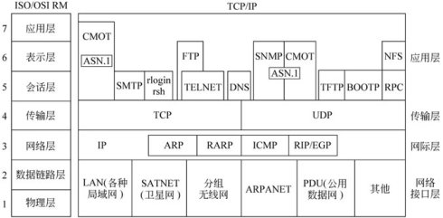

## TCP/IP



* [TCP：三次握手、四次握手、backlog及其他](https://www.cnblogs.com/xrq730/p/6910719.html)
* [TCP/IP协议（一）网络基础知识](http://www.cnblogs.com/imyalost/p/6086808.html)
* [TCP SOCKET中backlog参数的用途是什么？](https://www.cnblogs.com/zengkefu/p/5602396.html)
                                                             
* TCP三次握手其实就是TCP连接建立的过程，三次握手的目的是同步连接双方的序列号和确认号并交换TCP窗口大小信息   
* 为什么在第3步中客户端还要再进行一次确认呢？这主要是为了防止已经失效的连接请求报文段突然又传回到服务端而产生错误的场景
* 已失效的连接请求（超时请求）被处理了                                         
* backlog的定义是已连接但未进行accept处理的socket队列大小                      
* 全连接队列的大小未必是backlog的值，它是backlog与somaxconn（一个os级别的系统参数）的较小值  
                                                             
## Http协议
基于请求/响应模式的、无状态的协议

### HTTP URL
URL 的一个例子
http://www.mywebsite.com/sj/test/test.aspx?name=sviergn&x=true#stuff

```
Schema:                 http
host:                   www.mywebsite.com
path:                   /sj/test/test.aspx
Query String:           name=sviergn&x=true
Anchor:                 stuff
```

### HTTP的Request/Response：

HTTP Request消息的结构
1.	Request line 请求方法URI协议/版本 
2.	Request header 请求头
3.	body 请求正文 (header和body之间有个空行)

```
GET/sample.jsp HTTP/1.1
Accept:image/gif.image/jpeg,*/*
Accept-Language:zh-cn
Connection:Keep-Alive
Host:localhost
User-Agent:Mozila/4.0(compatible;MSIE5.01;Window NT5.0)
Accept-Encoding:gzip,deflate

username=jinqiao&password=1234
```

HTTP Response消息的结构

1.	Response line 协议状态版本代码描述
2.	Response header 响应头
3.	body 响应正文 (header和body之间有个空行)

```
HTTP/1.1 200 OK
Server:Apache Tomcat/5.0.12
Date:Mon,6Oct2003 13:23:42 GMT
Content-Length:112
 
<html>
<head>
<title>HTTP响应示例<title>
</head>
<body>
Hello HTTP!
</body>
</html>
```


## Socket
这是为了实现以上的通信过程而建立成来的通信管道，其真实的代表是客户端和服务器端的一个通信进程，双方进程通过socket进行通信，而通信的规则采用指定的协议。socket只是一种连接模式，不是协议，tcp、udp，简单的说（虽然不准确）是两个最基本的协议,很多其它协议都是基于这两个协议如，http就是基于tcp的，用socket可以创建tcp连接，也可以创建udp连接，这意味着，用socket可以创建任何协议的连接，因为其它协议都是基于此的。

## https
HTTP 协议中没有加密机制，但可以通过和SSL（Secure Socket Layer，安全套接层）或TLS（Transport LayerSecurity，安全层传输协议）的组合使用，加密 HTTP 的通信内容。

HTTP + 加密 + 认证 + 完整性保护 = HTTPS
HTTPS 是身披 SSL 外壳的 HTTP

### http隐患
HTTP 协议的实现本身非常简单，不论是谁发送过来的请求都会返回响应，因此不确认通信方，会存在以下各种隐患。
1.	无法确定请求发送至目标的 Web 服务器是否是按真实意图返回响应的那台服务器。有可能是已伪装的 Web 服务器。
2.	无法确定响应返回到的客户端是否是按真实意图接收响应的那个客户端。有可能是已伪装的客户端。
3.	无法确定正在通信的对方是否具备访问权限。因为某些Web 服务器上保存着重要的信息， 只想发给特定用户通信的权限。
4.	无法判定请求是来自何方、出自谁手。
5.	即使是无意义的请求也会照单全收。无法阻止海量请求下的DoS 攻击（ Denial of Service， 拒绝服务攻击） 。


## Http 2                                                    
                                                             
1.	异步连接多路复用                                                 
2.	头部压缩                                                     
3.	请求/响应管线化                                                 
                                                             
保持与HTTP 1.1语义的向后兼容性也是该版本的一个关键目标。                             
SPDY是一种HTTP兼容协议，由Google发起，Chrome、Opera、Firefox以及Amazon Silk等浏
HTTP实现的瓶颈之一是其并发要依赖于多重连接。HTTP管线化技术可以缓解这个问题，但也只能做到部分多路复用。      
此外，已经证实，由于存在中间干扰，浏览器无法采用管线化技术。                               
                                                             
SPDY在单个连接之上增加了一个帧层，用以多路复用多个并发流。帧层针对HTTP类的请求响应流进行了优化，因此运行在HTTP
                                                             
多路复用请求；对请求划分优先级；压缩HTTP头；服务器推送流（即Server Push技术）；SPDY试图保留HTTP的现
                                                             
## SPDY                                                      
SPDY（读作“SPeeDY”）是Google开发的基于TCP的应用层协议，用以最小化网络延迟，提升网络速度，优化用户的网
SPDY并不是一种用于替代HTTP的协议，而是对HTTP协议的增强。                           
新协议的功能包括数据流的多路复用、请求优先级以及HTTP报头压缩。谷歌表示，引入SPDY协议后，在实验室测试中页面加载速度
                                                             
### SPDY 原理                                                  
在SSL层上增加一个SPDY会话层，以在一个TCP连接中实现并发流。                           
通常的HTTP GET和POST格式仍然是一样的；然而SPDY为编码和传输数据设计了一个新的帧格式。           
流是双向的，可以在客户端和服务器端启动。                                         
SPDY旨在通过基本（始终启用）和高级（可选启用）功能实现更低的延迟。        