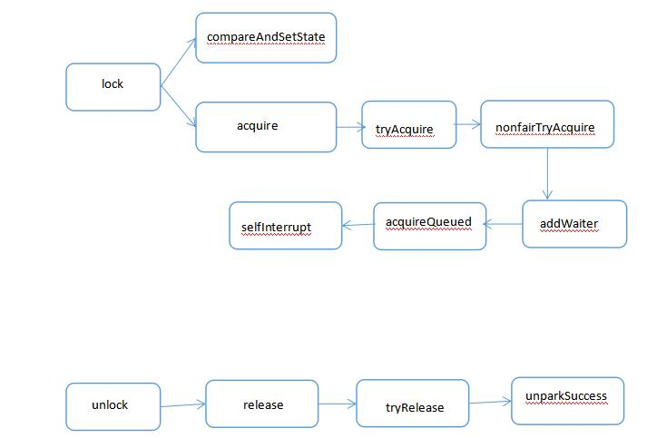

# java.util.concurrent

 

## Lock

 

## 并发容器

### ConcurrentHashMap

*	volatile
*	ReetrantLok
*	hash()算法	
*	数组		散列算法、按位与确定索引
*	单向链表
*	红黑树	O(n) -> O(logN)

#### 类图
 

#### 结构图
 

### ConcurrentLinkedQueue

### 阻塞队列

支持阻塞的插入和移除方法。put(e), take(), offer(e, time, unit), poll(time, unit)

