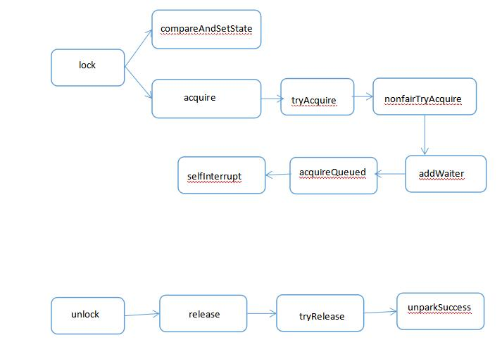

Locks

演化 

1. synchronize this 发现不太好
2. Object lock = new Object; synchronize (lock) {} 使用一个Object对象，替代this
3. 将Object lock = new Object()，抽象出Lock接口, await(), singal(), singalAll()

## Lock

 

* 独占锁
* 共享锁
* 读写锁 读写分离

## Lock Condition

Condition 将 Object 监视器方法（wait、notify 和 notifyAll）分解成截然不同的对象，以便通过将这些对象与任意 Lock 实现组合使用，为每个对象提供多个等待 set （wait-set）。
其中，Lock 替代了 synchronized 方法和语句的使用，Condition 替代了 Object 监视器方法的使用。

在Condition中，用await()替换wait()，用signal()替换notify()，用signalAll()替换notifyAll()，传统线程的通信方式，Condition都可以实现，
这里注意，Condition是被绑定到Lock上的，要创建一个Lock的Condition必须用newCondition()方法。

Condition的强大之处在于它可以为多个线程间建立不同的Condition，
使用synchronized/wait()只有一个阻塞队列，notifyAll会唤起所有阻塞队列下的线程，
而使用lock/condition，可以实现多个阻塞队列，signalAll只会唤起某个阻塞队列下的阻塞线程。

## AbstractQueuedSynchronizer 队列同步器

就是被称之为AQS的类，它是一个非常有用的超类，可用来定义锁以及依赖于排队阻塞线程的其他同步器

## 锁基本概念

* AQS -- 指AbstractQueuedSynchronizer类。
AQS是java中管理“锁”的抽象类，锁的许多公共方法都是在这个类中实现。AQS是独占锁(例如，ReentrantLock)和共享锁(例如，Semaphore)的公共父类。

* AQS锁的类别 -- 分为“独占锁”和“共享锁”两种。
(01) 独占锁 -- 锁在一个时间点只能被一个线程锁占有。根据锁的获取机制，它又划分为“公平锁”和“非公平锁”。
公平锁，是按照通过CLH等待线程按照先来先得的规则，公平的获取锁；而非公平锁，则当线程要获取锁时，它会无视CLH等待队列而直接获取锁。
独占锁的典型实例子是ReentrantLock，此外，ReentrantReadWriteLock.WriteLock也是独占锁。
(02) 共享锁 -- 能被多个线程同时拥有，能被共享的锁。JUC包中的ReentrantReadWriteLock.ReadLock，CyclicBarrier， CountDownLatch和Semaphore都是共享锁。这些锁的用途和原理，在以后的章节再详细介绍。

* CLH队列 -- Craig, Landin, and Hagersten lock queue
CLH队列是AQS中“等待锁”的线程队列。在多线程中，为了保护竞争资源不被多个线程同时操作而起来错误，我们常常需要通过锁来保护这些资源。
在独占锁中，竞争资源在一个时间点只能被一个线程锁访问；而其它线程则需要等待。CLH就是管理这些“等待锁”的线程的队列。
CLH是一个非阻塞的 FIFO 队列。也就是说往里面插入或移除一个节点的时候，在并发条件下不会阻塞，而是通过**自旋锁**和**CAS**保证节点插入和移除的原子性。
CLH锁是一种基于链表的可扩展、高性能、公平的自旋锁，申请线程仅仅在本地变量上自旋，它不断轮询前驱的状态，假设发现前驱释放了锁就结束自旋。

* CAS函数 -- Compare And Swap 
CAS函数，是比较并交换函数，它是原子操作函数；即，通过CAS操作的数据都是以原子方式进行的。
例如，compareAndSetHead(), compareAndSetTail(), compareAndSetNext()等函数。它们共同的特点是，这些函数所执行的动作是以原子的方式进行的。

## AQS

[Java并发之AQS详解](https://www.cnblogs.com/daydaynobug/p/6752837.html)

它维护了一个volatile int state（代表共享资源）和一个FIFO线程等待队列（多线程争用资源被阻塞时会进入此队列）。

### state的访问方式有三种:

* getState()
* setState()
* compareAndSetState()

### AQS定义两种资源共享方式：

* Exclusive（独占，只有一个线程能执行，如ReentrantLock）
* Share（共享，多个线程可同时执行，如Semaphore/CountDownLatch）。

不同的自定义同步器争用共享资源的方式也不同。
自定义同步器在实现时只需要实现共享资源state的获取与释放方式即可，至于具体线程等待队列的维护（如获取资源失败入队/唤醒出队等），AQS已经在顶层实现好了。

### 自定义同步器实现时主要实现以下几种方法：

* isHeldExclusively()：该线程是否正在独占资源。只有用到condition才需要去实现它。
* tryAcquire(int)：独占方式。尝试获取资源，成功则返回true，失败则返回false。
* tryRelease(int)：独占方式。尝试释放资源，成功则返回true，失败则返回false。
* tryAcquireShared(int)：共享方式。尝试获取资源。负数表示失败；0表示成功，但没有剩余可用资源；正数表示成功，且有剩余资源。
* tryReleaseShared(int)：共享方式。尝试释放资源，成功则返回true，失败则返回false。

以ReentrantLock为例，state初始化为0，表示未锁定状态。
A线程lock()时，会调用tryAcquire()独占该锁并将state+1。
此后，其他线程再tryAcquire()时就会失败，直到A线程unlock()到state=0（即释放锁）为止，其它线程才有机会获取该锁。
当然，释放锁之前，A线程自己是可以重复获取此锁的（state会累加），这就是可重入的概念。但要注意，获取多少次就要释放多么次，这样才能保证state是能回到零态的。

再以CountDownLatch以例，任务分为N个子线程去执行，state也初始化为N（注意N要与线程个数一致）。
这N个子线程是并行执行的，每个子线程执行完后countDown()一次，state会CAS减1。
等到所有子线程都执行完后(即state=0)，会unpark()主调用线程，然后主调用线程就会从await()函数返回，继续后余动作。

一般来说，自定义同步器要么是独占方法，要么是共享方式，他们也只需实现tryAcquire-tryRelease、tryAcquireShared-tryReleaseShared中的一种即可。
但AQS也支持自定义同步器同时实现独占和共享两种方式，如ReentrantReadWriteLock。