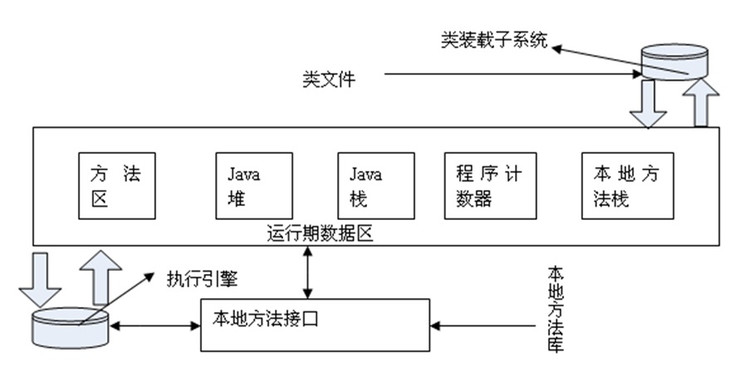

# jvm内存分配与回收
动态内存管理

## JVM运行时内存结构




堆内存 = 年轻代 + 年老代 + 永久代
年轻代 = Eden区 + 两个Survivor区（From和To）

## 判定
在Java中采取了 可达性分析法，基本思想是通过一系列的“GC Roots”对象作为起点进行搜索，如果在“GC Roots”和一个对象之间没有可达路径，则称该对象是不可达的，不过要注意的是被判定为不可达的对象不一定就会成为可回收对象。被判定为不可达的对象要成为可回收对象必须至少经历两次标记过程，如果在这两次标记过程中仍然没有逃脱成为可回收对象的可能性，则基本上就真的成为可回收对象了。

### GC Root的对象

栈（虚拟机栈、本地方法栈）、方法区

1. 虚拟机（JVM）栈中的引用的对象
2. 方法区中的类静态属性引用的对象
3. 方法区中的常量引用的对象（主要指声明为final的常量值）
4. 本地方法栈中JNI的引用的对象

## jvm内存设置

```shell
	java heap					-Xms and -Xmx
	permanent generation		-XX:PermSize -XX:MaxPermSize
	young generation 			-Xmn
	old generation
```
	

