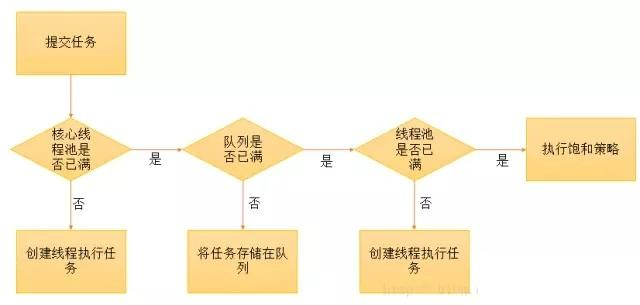
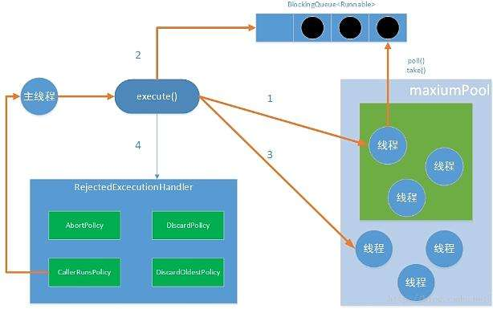

# 线程池 ThreadPoolExecutor

数据库连接池（mysql、redis）、服务器连接池（tomcat、netty、dubbo）、任务调度（task、job）、异步

### 使用线程池主要为了解决一下几个问题：
1. 通过重用线程池中的线程，来减少每个线程**创建和销毁**的性能开销。
2. 对线程进行一些维护和管理，比如定时开始，周期执行，并发数控制等等。

### 为什么要用线程池:
1. 消耗过多的内存(每个线程需要大约1MB内存)。
2. 节省创建和销毁线程的时间，实现**线程复用**。

### 使用场景
计算密集型，少一些；IO密集型，多一些；都有的，考虑拆分和解耦

1. 高并发、任务执行时间短的业务，线程池线程数可以设置为CPU核数+1，减少线程上下文的切换
2. 并发不高、任务执行时间长的业务要区分开看：
  * 假如是业务时间长集中在IO操作上，也就是IO密集型的任务，因为IO操作并不占用CPU，所以不要让所有的CPU闲下来，可以加大线程池中的线程数目，让CPU处理更多的业务
  * 假如是业务时间长集中在计算操作上，也就是计算密集型任务，这个就没办法了，和（1）一样吧，线程池中的线程数设置得少一些，减少线程上下文的切换
3. 并发高、业务执行时间长，解决这种类型任务的关键不在于线程池而在于整体架构的设计，看看这些业务里面某些数据是否能做缓存是第一步，增加服务器是第二步，至于线程池的设置，设置参考（2）。
  最后，业务执行时间长的问题，也可能需要分析一下，看看能不能使用中间件对任务进行拆分和解耦

## Executor
ThreadPoolExecutor -> AbstractExecutorService -> ExecutorService -> Executor

## ThreadPoolExecutor构造参数
1.	corePoolSize
	核心线程数，默认情况下核心线程会一直存活，即使处于闲置状态也不会受存keepAliveTime限制。除非将allowCoreThreadTimeOut设置为true。
2.	maximumPoolSize
	线程池所能容纳的最大线程数。超过这个数的线程将被阻塞。当任务队列为没有设置大小的LinkedBlockingDeque时，这个值无效。
3.	keepAliveTime
	非核心线程的闲置超时时间，超过这个时间就会被回收。
4.	unit
	指定keepAliveTime的单位，如TimeUnit.SECONDS。当将allowCoreThreadTimeOut设置为true时对corePoolSize生效。
5.	workQueue
	线程池中的任务队列.常用的有三种队列，SynchronousQueue,LinkedBlockingDeque,ArrayBlockingQueue。
6.	threadFactory
	线程工厂，提供创建新线程的功能。ThreadFactory是一个接口，只有一个方法
7.	RejectedExecutionHandler
	RejectedExecutionHandler也是一个接口，只有一个方法。当线程池中的资源已经全部使用，添加新线程被拒绝时，会调用RejectedExecutionHandler的rejectedExecution方法。
	
	
## 线程池规则

线程池的线程执行规则跟任务队列有很大的关系。

### 任务队列没有大小限制
1.	如果线程数量<=核心线程数量，那么直接启动一个核心线程来执行任务（**获取全局锁**），不会放入队列中。
2.	如果线程数量>核心线程数，但<=最大线程数，并且任务队列是LinkedBlockingDeque的时候，超过核心线程数量的任务会放在任务队列中排队。（**不需要获取全局锁，线程池预热之后尽量走此路径**）
3.	如果线程数量>核心线程数，但<=最大线程数，并且任务队列是SynchronousQueue的时候，线程池会创建新线程执行任务（**获取全局锁**），这些任务也不会被放在任务队列中。这些线程属于非核心线程，在任务完成后，闲置时间达到了超时时间就会被清除。
4.	如果线程数量>核心线程数，并且>最大线程数，当任务队列是LinkedBlockingDeque，会将超过核心线程的任务放在任务队列中排队。也就是当任务队列是LinkedBlockingDeque并且没有大小限制时，线程池的最大线程数设置是无效的，他的线程数最多不会超过核心线程数。
5.	如果线程数量>核心线程数，并且>最大线程数，当任务队列是SynchronousQueue的时候，会因为线程池拒绝添加任务而抛出异常。

### 任务队列大小有限时
1.	当LinkedBlockingDeque塞满时，新增的任务会直接创建新线程来执行，当创建的线程数量超过最大线程数量时会抛异常。
2.	SynchronousQueue没有数量限制。因为他根本不保持这些任务，而是直接交给线程池去执行。当任务数量超过最大线程数时会直接抛异常。

### 线程池执行流程

 

 

## links
* [线程池的原理与使用场景](https://www.cnblogs.com/kaffeetrinken/p/8548549.html)
* [线程池的各种使用场景](https://blog.csdn.net/qq_17045385/article/details/79820847 )

