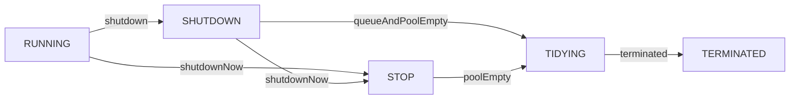

## 类图
```yuml
// {type:class}

// 核心线程数、最大线程数、空闲时间
[ThreadPoolExecutor|-corePoolSize;-maximumPoolSize;-keepAliveTime;-unit;-workQueue;-threadFactory;-handler|]

// 1. 继承关系
[Executor]^-[ExecutorService]
[ExecutorService]^-.-[AbstractExecutorService]
[AbstractExecutorService]^-[ThreadPoolExecutor]

// 2. 工作队列
[ThreadPoolExecutor]++-[BlockingQueue]

// 3. 工作者
[Worker|thread;firstTask;|]
[ThreadPoolExecutor]++-[Worker]

// 3.1 工作者继承抽象队列同步器，拥有锁的能力
[AbstractOwnableSynchronizer]^-[AbstractQueuedSynchronizer]
[AbstractQueuedSynchronizer]^-[Worker]
[Runnable]^-.-[Worker]

// 4. 全局锁
[ThreadPoolExecutor]++-[ReentrantLock]
[ThreadPoolExecutor]++-[Condition]

// 5. 线程工厂、饱和策略
[ThreadPoolExecutor]++-[ThreadFactory]
[ThreadPoolExecutor]++-[RejectedExecutionHandler]

```

## 状态图

* RUNNING(-1):  Accept new tasks and process queued tasks
* SHUTDOWN(0): Don't accept new tasks, but process queued tasks
* STOP(1):     Don't accept new tasks, don't process queued tasks,
            and interrupt in-progress tasks
* TIDYING(2):  All tasks have terminated, workerCount is zero,
            the thread transitioning to state TIDYING
            will run the terminated() hook method
* TERMINATED(3): terminated() has completed
     


## execute()

```mermaid
sequenceDiagram
    Actor->>ThreadPoolExecutor:execute(command)
    
    %% 1. 原子变量获得状态和数量
    ThreadPoolExecutor->>AtomicInteger:获得线程池状态和线程数量get()
    
    %% 2. 小于核心线程池数量
    opt workerCount < corePoolSize
        opt
            ThreadPoolExecutor->>ThreadPoolExecutor:addWorker(command, true)添加核心线程的Worker
        end
    end
    
    %% 3. 添加任务失败
    alt isRunning(c)并且可以取出任务
        
        ThreadPoolExecutor->>AtomicInteger:重新获得线程池状态和线程数量get()
        
        alt 不是运行状态并且可以删除任务
            ThreadPoolExecutor->>ThreadPoolExecutor:reject(command)
            ThreadPoolExecutor->>RejectedExecutionHandler:rejectedExecution(command,this)
            
        else 工作线程的数量等于0
            ThreadPoolExecutor->>ThreadPoolExecutor:addWorker(null, false)添加非核心线程的Worker
        end
        
    else 不能添加非核心线程Worker
        ThreadPoolExecutor->>ThreadPoolExecutor:reject(command)
        ThreadPoolExecutor->>RejectedExecutionHandler:rejectedExecution(command,this)
    end
```