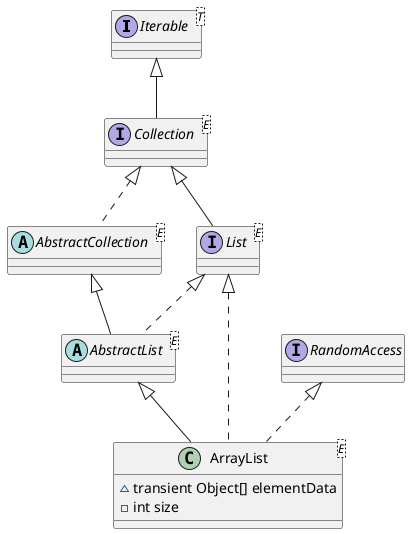

java.util.ArrayList

## hierarchy
```
AbstractCollection (java.util)
    AbstractList (java.util)
        ArrayList (java.util)
```

## class

```plantuml
@startuml

'''''''''''''''''''''''''''Collection、List'''''''''''''''''''''''''''
interface Iterable<T>
interface Collection<E>
Iterable <|-- Collection
interface List<E>
Collection <|-- List

abstract class AbstractCollection<E>
Collection <|.. AbstractCollection

abstract class AbstractList<E>
List <|.. AbstractList
AbstractCollection <|-- AbstractList

'''''''''''''''''''''''''''随机访问'''''''''''''''''''''''''''
interface RandomAccess

class ArrayList<E> {
    ~ transient Object[] elementData
    - int size
}
List <|.. ArrayList
RandomAccess <|.. ArrayList
AbstractList <|-- ArrayList

@enduml
```