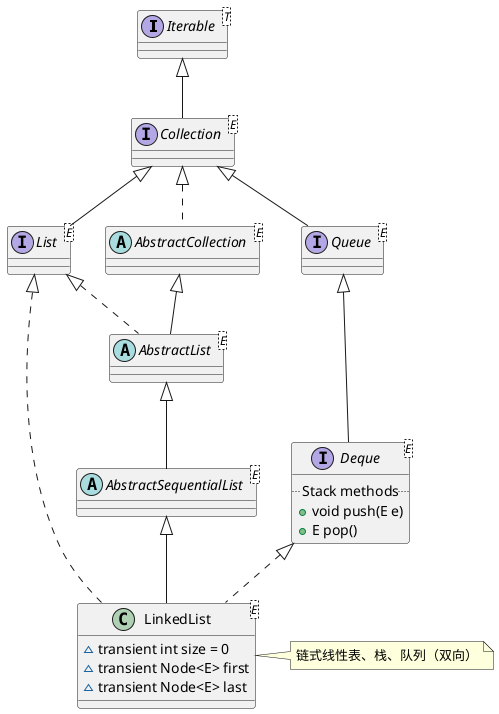

java.util.LinkedList

## hierarchy
```
AbstractCollection (java.util)
    AbstractList (java.util)
        AbstractSequentialList (java.util)
            LinkedList (java.util)
```

## class


```plantuml
@startuml

'''''''''''''''''''''''''''Collection、List'''''''''''''''''''''''''''
interface Iterable<T>
interface Collection<E>
Iterable <|-- Collection
interface List<E>
Collection <|-- List

abstract class AbstractCollection<E>
Collection <|.. AbstractCollection

abstract class AbstractList<E>
List <|.. AbstractList
AbstractCollection <|-- AbstractList

'''''''''''''''''''''''''''连续的访问'''''''''''''''''''''''''''
abstract class AbstractSequentialList<E>
AbstractList <|-- AbstractSequentialList

'''''''''''''''''''''''''''Queue、Deque、Stack'''''''''''''''''''''''''''
interface Queue<E>
interface Deque<E> {
    .. Stack methods ..
    + void push(E e)
    + E pop()
}
Collection <|-- Queue
Queue <|-- Deque


class LinkedList<E> {
    ~ transient int size = 0
    ~ transient Node<E> first
    ~ transient Node<E> last
}
note right of LinkedList : 链式线性表、栈、队列（双向）

List <|.. LinkedList
Deque <|.. LinkedList
AbstractSequentialList <|-- LinkedList

@enduml
```