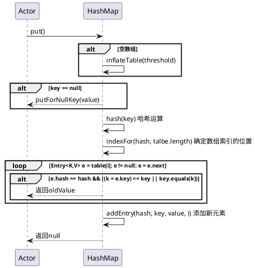
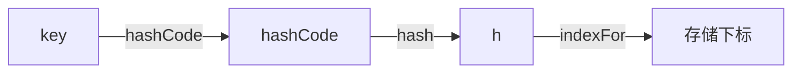
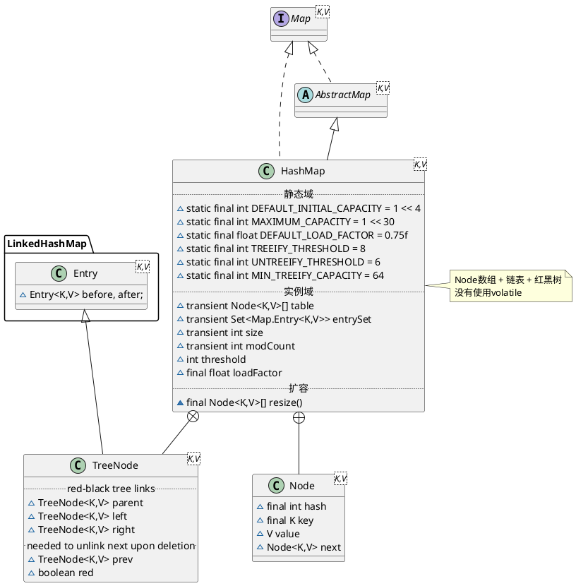

## 1. jdk7 HashMap


## 1.1 hierarchy
```
AbstractMap (java.util)
    HashMap (java.util)
    LinkedHashMap (java.util)
```

## 1.2 define
* 静态域
* 实例域
  * capacity：当前数组容量，始终保持 2^n，可以扩容，扩容后数组大小为当前的 2 倍。
  * loadFactor：负载因子，默认为 0.75。
  * threshold：扩容的阈值，等于 capacity * loadFactor
* 内部类
  * Holder
  * Entry
  * HashIterator
  * ValueIterator
  * KeyIterator
  * EntryIterator
  * KeySet
  * Values
  * EntrySet

```plantuml
@startuml

''''''''''''''''''''''''' Map ''''''''''''''''''''''''''''''
interface Map<K,V>
abstract class AbstractMap<K,V> 
Map <|.. AbstractMap

''''''''''''''''''''''''' HashMap ''''''''''''''''''''''''''''''
class HashMap<K,V> {
    .. 静态域 ..
    static final int DEFAULT_INITIAL_CAPACITY = 1 << 4
    static final int MAXIMUM_CAPACITY = 1 << 30
    static final float DEFAULT_LOAD_FACTOR = 0.75f
    .. 实例域 ..
    static final Entry<?,?>[] EMPTY_TABLE = {};
    transient Entry<K,V>[] table = (Entry<K,V>[]) EMPTY_TABLE;
    transient int size;
    transient int modCount
    int threshold
    final float loadFactor
    ransient int hashSeed = 0
    .. 数组填充（为table分配实际内存空间） ..
    - void inflateTable(int toSize) 
    final boolean initHashSeedAsNeeded(int capacity)
    final int hash(Object k)
}

note right
数组 + 链表
没有使用volatile
end note

Map <|.. HashMap
AbstractMap <|-- HashMap

''''''''''''''''''''''''' Entry ''''''''''''''''''''''''''''''
interface Map.Entry<K,V> 
Map.Entry <|.. Entry
class Entry<K,V> {
    final K key
    V value
    Entry<K,V> next
    int hash
}

HashMap +-- Entry

@enduml
```

## 1.3 put()
1. 如果数组为空数组，则数组初始化
2. key为null的情况特殊处理，置于table[0]
3. 确定数组索引位置。根据key计算hash值，找到相应的数组下标：hash & (length – 1) 位运算
4. 如果数组位置存在元素，则替换，并返回老值
5. 添加节点到链表中
  * 容量大于阈值，需要rehash()，重新哈希计算数组索引位置
  * 创建新Entry，置于数组索引位置，压入单向链表，数量自增

### put()时序


### 数组下标确定流程
* key计算hashCode
* hashCode再哈希 位运算
* 确定数组索引 位运算


## 1.4 rehash()

## 1.5 get()
1. key为null特殊处理
2. 确定数组索引位置
3. 遍历该数组位置处的链表，返回哈希值相等或者key equals（==或equals）的元素


## 1.6 remove()
1. key为null特殊处理
2. 确定数组索引位置
3. 遍历链表，当哈希值相等或者key equals的时候，将此元素离开链表
  * 如果存在前趋，将前趋的next指向次元素的后继
  * 如果不存在前趋，将此元素的后继置于数组索引位置
  

# 2. jdk8 HashMap


## 2.1 define
* 静态域
  * TREEIFY_THRESHOLD = 8
  * UNTREEIFY_THRESHOLD = 6
  * MIN_TREEIFY_CAPACITY = 64
* 实例域
  * Node<K,V>[] table
  * Set<Map.Entry<K,V>> entrySet
  * size
  * modCount
  * threshold
  * loadFactor
* 内部类
  * Node
  * KeySet
  * Values
  * EntrySet
  * HashIterator
  * KeyIterator
  * ValueIterator
  * EntryIterator
  * HashMapSpliterator
  * KeySpliterator
  * ValueSpliterator
  * EntrySpliterator
  * TreeNode



## links
[Java7/8 中的 HashMap 和 ConcurrentHashMap 全解析](http://www.importnew.com/28263.html)


