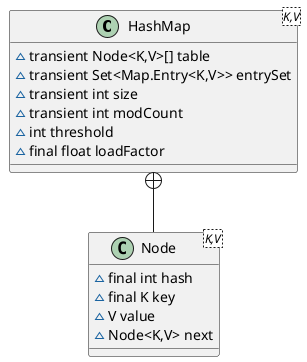

java.util.HashMap

## hierarchy
```
AbstractMap (java.util)
    HashMap (java.util)
    LinkedHashMap (java.util)
```

## class



## Java7 HashMap
Entry[], slist

* field

```
capacity：当前数组容量，始终保持 2^n，可以扩容，扩容后数组大小为当前的 2 倍。
loadFactor：负载因子，默认为 0.75。
threshold：扩容的阈值，等于 capacity * loadFactor
```

* Entry

```
	final K key;
	V value;
	Entry<K,V> next;
	int hash;
```


#### put 过程分析
* 数组初始化
* 计算hash值
* 计算具体数组位置
* 添加节点到链表中
* 数组扩容

#### get 过程分析
1. 根据 key 计算 hash 值。
2. 找到相应的数组下标：hash & (length – 1)。
3. 遍历该数组位置处的链表，直到找到相等(==或equals)的 key。


