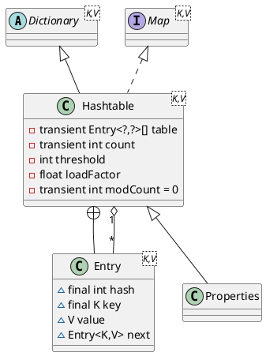

## hierarchy
```
Dictionary (java.util)
    Hashtable (java.util)
        Properties (java.util)
```

## class

```plantuml
@startuml

abstract class Dictionary<K,V> {

}

interface Map<K,V> {

}

class Hashtable<K,V> {
    - transient Entry<?,?>[] table
    - transient int count
    - int threshold
    - float loadFactor
    - transient int modCount = 0
}

class Entry<K,V>{
    ~ final int hash
    ~ final K key
    ~ V value
    ~ Entry<K,V> next
}

Hashtable +-- Entry
Hashtable "1" o-- "*" Entry

class Properties {

}

Dictionary <|-- Hashtable
Map <|.. Hashtable
Hashtable <|-- Properties

@enduml
```