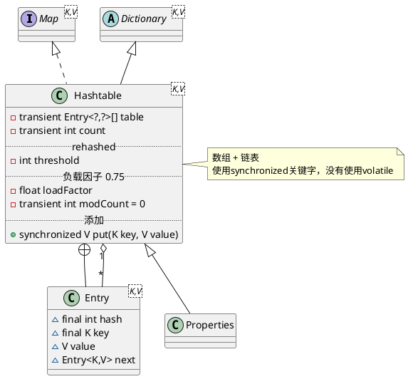

# Hashtable

## hierarchy
```
Dictionary (java.util)
    Hashtable (java.util)
        Properties (java.util)
```

## define
* 静态域
* 对象域
  * 数组 Entry<K,V>[] table
  * count
* 内部类
  * Holder
  * KeySet
  * EntrySet
  * ValueCollection
  * Entry
  * Enumerator



## synchronized put()
1. value为null抛异常
2. 确定数组索引位置 hash = hash(key), index = (hash & 0x7FFFFFFF) % tab.length 取模运算
3. 如果数组位置存在元素，则替换，并返回老值
4. 不存在，容量大于阈值，需要rehash()，重新哈希计算数组索引位置
5. 创建新Entry，置于数组索引位置，压入单向链表，数量自增

## rehash()

## synchronized get()
1. 确定数组索引位置
2. 遍历该数组位置处的链表，返回哈希值相等或者key equals（==或equals）的元素

## synchronized remove()
1. 确定数组索引位置
2. 遍历链表，当哈希值相等或者key equals的时候，将此元素离开链表
  * 如果存在前趋，将前趋的next指向次元素的后继
  * 如果不存在前趋，将此元素的后继置于数组索引位置