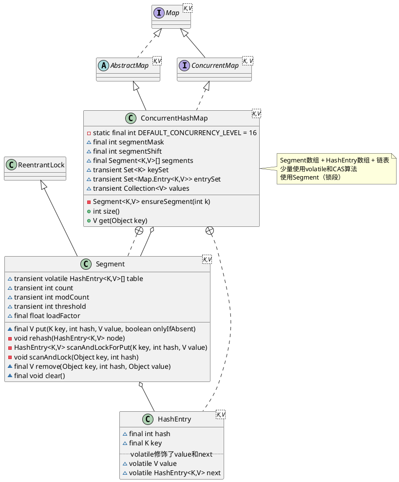

java.util.concurrent.ConcurrentHashMap

# 1. jdk7 ConcurrentHashMap
* 分段锁，HashTable表锁
  * Segment 类似HashMap结构，内部拥有Entry数组，数组中的每个元素有时一个链表
  * 继承ReentrantLock 
* 弱一致性，HashTable的迭代器是强一致性的


## 1.1 define
* 静态域
  * DEFAULT_INITIAL_CAPACITY = 16
  * DEFAULT_LOAD_FACTOR = 0.75F
  * DEFAULT_CONCURRENCY_LEVEL = 16
  * MAXIMUM_CAPACITY = 1073741824
  * MIN_SEGMENT_TABLE_CAPACITY = 2
  * MAX_SEGMENTS = 65536
  * RETRIES_BEFORE_LOCK = 2
* 实例域
  * final int segmentMask
  * final int segmentShift
  * final ConcurrentHashMap.Segment<K, V>[] segments
  * transient Set<K> keySet
  * transient Set<Entry<K, V>> entrySet
  * transient Collection<V> values
* 内部类
  * EntryIterator
  * EntrySet
  * HashEntry
  * HashIterator
  * Holder
  * KeyIterator
  * KeySet
  * Segment
  * ValueIterator
  * Values
  * WriteThroughEntry




## 1.2 初始化

## 1.3 put 过程分析
* Segment 内部是由 数组+链表 组成的。
* 初始化槽: ensureSegment
* 获取写入锁: scanAndLockForPut
* 扩容: rehash segment 数组不能扩容，扩容是 segment 数组某个位置内部的数组 HashEntry[] 进行扩容，扩容后，容量为原来的 2 倍。

## 1.4 get 过程分析

## 1.5 remove
和put类似，remove在真正获得锁之前，也会对链表进行遍历以提高缓存命中率


# 2. jdk8 ConcurrentHashMap
* 53个内部类
* 91个方法
* 1个静态代码块
* 37个字段，其中27个常量、10个字段


## 2.1 define
* 静态域
* 实例域
* 内部类

```plantuml
@startuml

''''''''''''''''''''''''' Map ''''''''''''''''''''''''''''''
interface Map<K,V>
abstract class AbstractMap<K,V> 
Map <|.. AbstractMap

''''''''''''''''''''''''' ConcurrentMap ''''''''''''''''''''''''''''''
interface ConcurrentMap<K, V>
Map <|-- ConcurrentMap

class ConcurrentHashMap<K,V> {
    - static final int DEFAULT_CONCURRENCY_LEVEL = 16
    ~ transient volatile Node<K,V>[] table
    - transient volatile Node<K,V>[] nextTable
    - transient volatile long baseCount
    - transient volatile int sizeCtl
    - transient volatile CounterCell[] counterCells
    - final Node<K,V>[] initTable()
}

note right
Node数组 + 链表 + 红黑树
大量使用volatile和CAS算法
摒弃了Segment（锁段）的概念
end note

AbstractMap <|-- ConcurrentHashMap
ConcurrentMap <|.. ConcurrentHashMap

''''''''''''''''''''''''' Segment ''''''''''''''''''''''''''''''
class ReentrantLock
class Segment<K,V> {
    ~ final float loadFactor
}

ReentrantLock <|-- Segment
ConcurrentHashMap +.. Segment

''''''''''''''''''''''''' Node ''''''''''''''''''''''''''''''
interface Map.Entry<K,V>
class Node<K,V> {
    ~ final int hash
    ~ final K key
    ~ volatile V val
    ~ volatile Node<K,V> next
}
Map.Entry <|.. Node
ConcurrentHashMap +.. Node
ConcurrentHashMap o.. Node

''''''''''''''''''''''''' TreeNode ''''''''''''''''''''''''''''''
class TreeNode<K,V> {
    TreeNode<K,V> parent
    TreeNode<K,V> left
    TreeNode<K,V> right
    TreeNode<K,V> prev
    boolean red
}
Node <|-- TreeNode

''''''''''''''''''''''''' TreeBin ''''''''''''''''''''''''''''''
class TreeBin<K,V> {
    TreeNode<K,V> root
    volatile TreeNode<K,V> first
    volatile Thread waiter
    volatile int lock
}
Node <|-- TreeBin

@enduml
```


## links
* [ConcurrentHashMap在JDK7和JDK8中的不同实现原理](https://blog.csdn.net/woaiwym/article/details/80675789)
* [ConcurrentHashMap能完全替代HashTable吗？](https://my.oschina.net/hosee/blog/675423)
* [Java7/8 中的 HashMap 和 ConcurrentHashMap 全解析](http://www.importnew.com/28263.html)