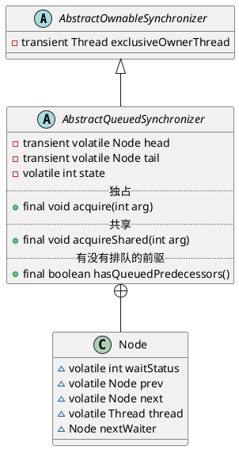

java.util.concurrent.locks.AbstractQueuedSynchronizer

## define

```plantuml
@startuml

abstract class AbstractOwnableSynchronizer {
    - transient Thread exclusiveOwnerThread
}

abstract class AbstractQueuedSynchronizer {
    - transient volatile Node head
    - transient volatile Node tail
    - volatile int state
    .. 独占 ..
    + final void acquire(int arg)
    .. 共享 ..
    + final void acquireShared(int arg) 
    .. 有没有排队的前驱 ..
    + final boolean hasQueuedPredecessors()
}

class Node {
    ~ volatile int waitStatus
    ~ volatile Node prev
    ~ volatile Node next
    ~ volatile Thread thread
    ~ Node nextWaiter
}

AbstractOwnableSynchronizer <|-- AbstractQueuedSynchronizer
AbstractQueuedSynchronizer +-- Node

@enduml
```
