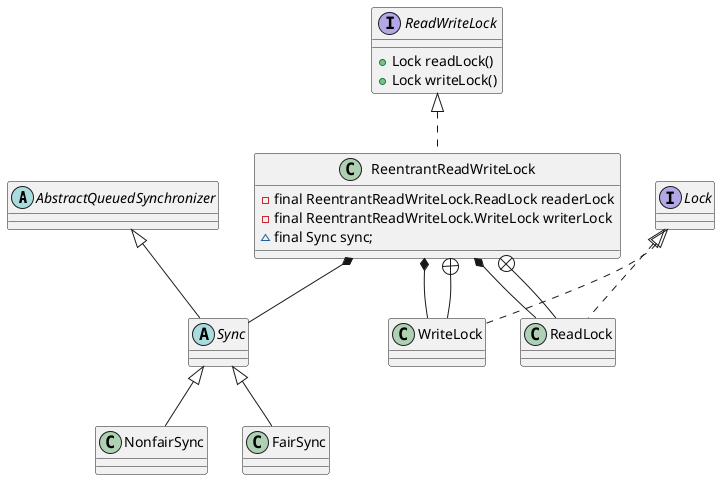

java.util.concurrent.locks.ReadWriteLock

java.util.concurrent.locks.ReentrantReadWriteLock

## define

```plantuml
@startuml

'''''''''''''''''''''''''''''''' AQS ''''''''''''''''''''''''''''''''
abstract class AbstractQueuedSynchronizer


'''''''''''''''''''''''''''''''' Sync FairSync NonfairSync''''''''''''''''''''''''''''''''
abstract class Sync
class NonfairSync
class FairSync
AbstractQueuedSynchronizer <|-- Sync
Sync <|-- NonfairSync
Sync <|-- FairSync

'''''''''''''''''''''''''''''''' ReadWriteLock ''''''''''''''''''''''''''''''''
interface Lock 
interface ReadWriteLock {
    + Lock readLock()
    + Lock writeLock()
}

class ReentrantReadWriteLock {
    - final ReentrantReadWriteLock.ReadLock readerLock
    - final ReentrantReadWriteLock.WriteLock writerLock
    ~ final Sync sync;
}
class ReadLock
class WriteLock

Lock <|.. ReadLock
Lock <|.. WriteLock

ReadWriteLock <|.. ReentrantReadWriteLock
ReentrantReadWriteLock *-- ReadLock
ReentrantReadWriteLock *-- WriteLock
ReentrantReadWriteLock *-- Sync
ReentrantReadWriteLock +-- ReadLock
ReentrantReadWriteLock +-- WriteLock

@enduml
```