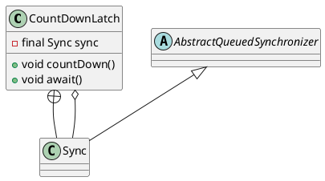

java.util.concurrent.CountDownLatch

## define

```plantuml
@startuml

class CountDownLatch {
    - final Sync sync
    + void countDown()
    + void await()
}

abstract class AbstractQueuedSynchronizer
AbstractQueuedSynchronizer ^-- Sync
class Sync {

}
CountDownLatch +-- Sync
CountDownLatch o-- Sync

@enduml
```