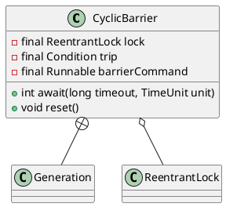

java.util.concurrent.CyclicBarrier

## define

```plantuml
@startuml

class CyclicBarrier {
    - final ReentrantLock lock
    - final Condition trip
    - final Runnable barrierCommand
    + int await(long timeout, TimeUnit unit)
    + void reset()
}

CyclicBarrier +-- Generation
class Generation 

CyclicBarrier o-- ReentrantLock

@enduml
```
