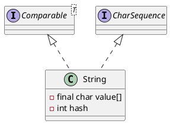

java.lang.String

## define

```plantuml
@startuml

interface Comparable<T>
interface CharSequence

class String {
    - final char value[]
    - int hash
}

Comparable <|.. String
CharSequence <|.. String

@enduml
```