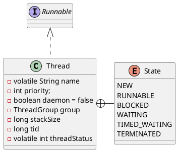

## define

```plantuml
@startuml

class Thread {
    - volatile String name
    - int priority;
    - boolean daemon = false
    - ThreadGroup group
    - long stackSize
    - long tid
    - volatile int threadStatus
}

interface Runnable
Runnable <|.. Thread

enum State {
    NEW
    RUNNABLE
    BLOCKED
    WAITING
    TIMED_WAITING
    TERMINATED
}
Thread +- State
    

@enduml
```
