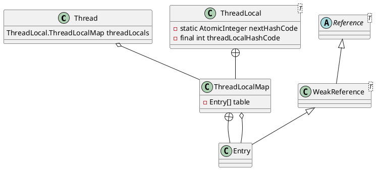

java.lang.ThreadLocal

```plantuml
@startuml

class Thread {
    ThreadLocal.ThreadLocalMap threadLocals
}
Thread o-- ThreadLocalMap

class ThreadLocal<T> {
    - static AtomicInteger nextHashCode
    - final int threadLocalHashCode
}

ThreadLocal +-- ThreadLocalMap

class ThreadLocalMap {
    - Entry[] table
}

ThreadLocalMap +-- Entry
ThreadLocalMap o-- Entry


abstract class Reference<T>
class WeakReference<T>
class Entry

Reference ^-- WeakReference
WeakReference ^-- Entry

@enduml
```