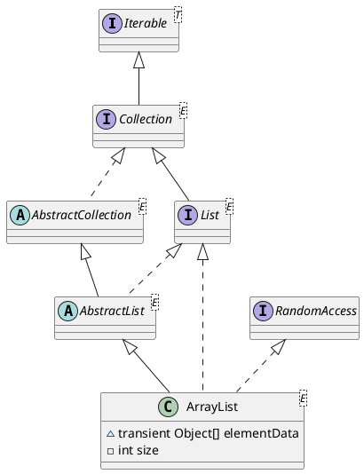

java.util.ArrayList

## hierarchy
```
AbstractCollection (java.util)
    AbstractList (java.util)
        ArrayList (java.util)
```

## define
* 静态域
  * DEFAULT_CAPACITY = 10
  * EMPTY_ELEMENTDATA
  * DEFAULTCAPACITY_EMPTY_ELEMENTDATA
  * MAX_ARRAY_SIZE = Integer.MAX_VALUE - 8
* 实例域
  * Object[] elementData
  * int size
* 内部类
  * Itr
  * ListItr
  * SubList
  * ArrayListSpliterator

