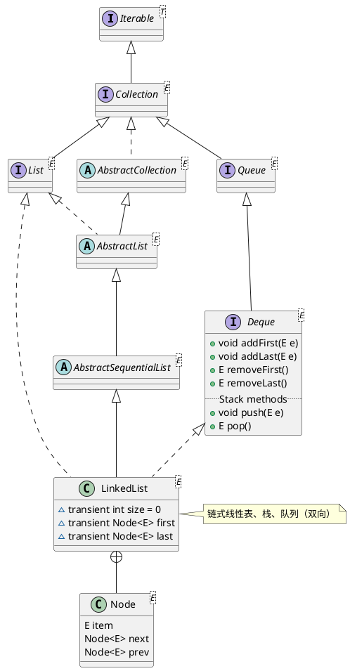

java.util.LinkedList

* 线性链表
* 队列
* 双端队列
* 栈


## hierarchy
```
AbstractCollection (java.util)
    AbstractList (java.util)
        AbstractSequentialList (java.util)
            LinkedList (java.util)
```

## define
* 实例域
  * size
  * Node<E> first
  * Node<E> last
* 内部类
  * ListItr
  * Node
  * DescendingIterator
  * LLSpliterator



## 添加
### boolean add(E e)
在链表尾部添加一个元素，如果成功，返回true，否则返回false。
### void addFirst(E e)
在链表头部插入一个元素。
### addLast(E e)
在链表尾部添加一个元素。
### void add(int index, E element)
在指定位置插入一个元素。

## 删除
### boolean remove(Object o)
从当前链表中移除指定的元素。
### E remove(int index)
从当前链表中移除指定位置的元素。
### E removeFirst()
从当前链表中移除第一个元素。
### E removeLast()
从当前链表中移除最后一个元素。
### E remove()
从当前链表中移除第一个元素，同removeLast()相同。

## 获取
### E get(int index)
从当前链表中获取指定位置的元素。
### E getFirst()
从当前链表中获取第一个元素。
### E getLast()
从当前链表中获取最后一个元素。

## 遍历
通过迭代器、foreach语句、for循环语句