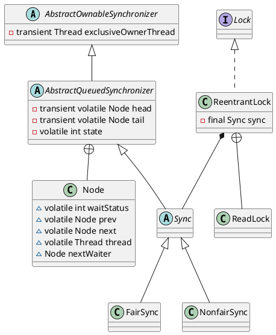

```plantuml
@startuml

'''''''''''''''''''''''''''''''' AQS ''''''''''''''''''''''''''''''''
abstract class AbstractOwnableSynchronizer {
    - transient Thread exclusiveOwnerThread
}

abstract class AbstractQueuedSynchronizer {
    - transient volatile Node head
    - transient volatile Node tail
    - volatile int state
}

class Node {
    ~ volatile int waitStatus
    ~ volatile Node prev
    ~ volatile Node next
    ~ volatile Thread thread
    ~ Node nextWaiter
}

AbstractOwnableSynchronizer <|-- AbstractQueuedSynchronizer
AbstractQueuedSynchronizer +-- Node

'''''''''''''''''''''''''''''''' Sync FairSync NonfairSync''''''''''''''''''''''''''''''''
abstract class Sync {

}

class FairSync {

}

class NonfairSync {

}
AbstractQueuedSynchronizer <|-- Sync
Sync <|-- NonfairSync
Sync <|-- FairSync

'''''''''''''''''''''''''''''''' ReentrantLock ''''''''''''''''''''''''''''''''
interface Lock 
class ReentrantLock {
    - final Sync sync
}

Lock <|.. ReentrantLock
ReentrantLock *-- Sync
ReentrantLock +-- ReadLock

@enduml
```