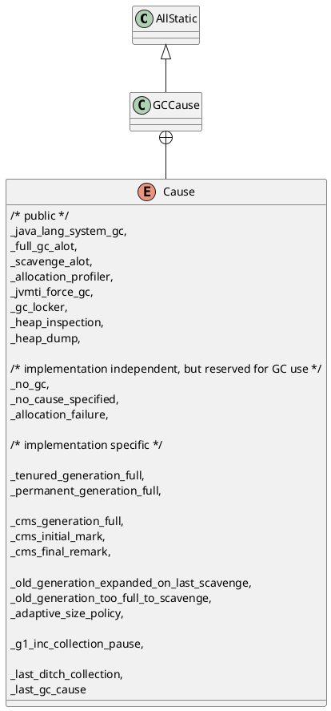

```plantuml
@startuml

AllStatic ^-- GCCause

class GCCause

GCCause +-- Cause

enum Cause {
    /* public */
    _java_lang_system_gc,
    _full_gc_alot,
    _scavenge_alot,
    _allocation_profiler,
    _jvmti_force_gc,
    _gc_locker,
    _heap_inspection,
    _heap_dump,

    /* implementation independent, but reserved for GC use */
    _no_gc,
    _no_cause_specified,
    _allocation_failure,

    /* implementation specific */

    _tenured_generation_full,
    _permanent_generation_full,

    _cms_generation_full,
    _cms_initial_mark,
    _cms_final_remark,

    _old_generation_expanded_on_last_scavenge,
    _old_generation_too_full_to_scavenge,
    _adaptive_size_policy,

    _g1_inc_collection_pause,

    _last_ditch_collection,
    _last_gc_cause
  }

@enduml
```
