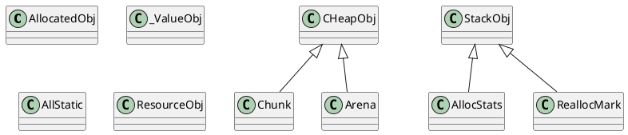

```plantuml
@startuml

class AllocatedObj
class CHeapObj
class StackObj
class _ValueObj
class AllStatic
class Chunk

CHeapObj ^-- Chunk
CHeapObj ^-- Arena

class ResourceObj

StackObj ^-- AllocStats
StackObj ^-- ReallocMark

class AllocStats
class ReallocMark

@enduml
```
