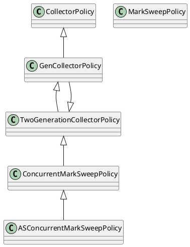

## define

```plantuml
@startuml

class CollectorPolicy
class GenCollectorPolicy
class TwoGenerationCollectorPolicy

CollectorPolicy ^-- GenCollectorPolicy
GenCollectorPolicy ^-- TwoGenerationCollectorPolicy

class MarkSweepPolicy
class ConcurrentMarkSweepPolicy
class ASConcurrentMarkSweepPolicy

TwoGenerationCollectorPolicy ^-- GenCollectorPolicy
TwoGenerationCollectorPolicy ^-- ConcurrentMarkSweepPolicy
ConcurrentMarkSweepPolicy ^-- ASConcurrentMarkSweepPolicy

@enduml
```
