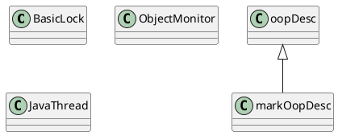

hotspot/src/share/vm/oops/markOop.hpp



```c
//  32 bits:
//  --------
//             hash:25 ------------>| age:4    biased_lock:1 lock:2 (normal object)
//             JavaThread*:23 epoch:2 age:4    biased_lock:1 lock:2 (biased object)
//             size:32 ------------------------------------------>| (CMS free block)
//             PromotedObject*:29 ---------->| promo_bits:3 ----->| (CMS promoted object)
```
