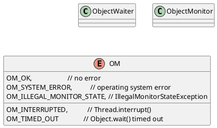

```plantuml
@startuml

class ObjectWaiter


class ObjectMonitor {

}


enum OM {
    OM_OK,                    // no error
    OM_SYSTEM_ERROR,          // operating system error
    OM_ILLEGAL_MONITOR_STATE, // IllegalMonitorStateException
    OM_INTERRUPTED,           // Thread.interrupt()
    OM_TIMED_OUT              // Object.wait() timed out
}
  
@enduml
```