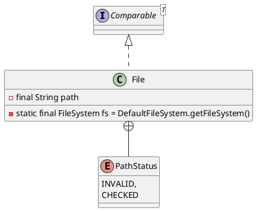

java.io.File
## hierarchy
```
File (java.io)
    ShellFolder (sun.awt.shell)
        Win32ShellFolder2 (sun.awt.shell)
        DefaultShellFolder (sun.awt.shell)
    WritableFile (org.codehaus.groovy.runtime)
    FileSystemRoot in FileSystemView (javax.swing.filechooser)
        2 in WindowsFileSystemView (javax.swing.filechooser)
    DirFile (org.apache.derby.impl.io)
```
## define    
