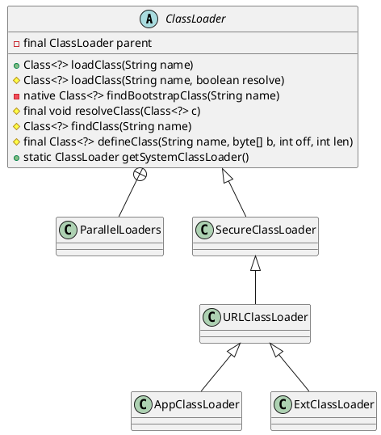

## hierarchy
```
ClassLoader (java.lang)
    1 in 2 in JMXConnectorFactory (javax.management.remote)
    SecureClassLoader (java.security)
        EventInfoClassLoader in EventHandlerCreator (oracle.jrockit.jfr.events)
        2 in JavaAdapterClassLoader (jdk.nashorn.internal.runtime.linker)
        1 in 1 in JavaAdapterServices (jdk.nashorn.internal.runtime.linker)
        NashornLoader (jdk.nashorn.internal.runtime)
            StructureLoader (jdk.nashorn.internal.runtime)
            ScriptLoader (jdk.nashorn.internal.runtime)
        URLClassLoader (java.net)
            DeployURLClassLoader (com.sun.deploy.security)
                JNLPClassLoader (com.sun.jnlp)
                Plugin2ClassLoader (sun.plugin2.applet)
                    JNLP2ClassLoader (sun.plugin2.applet)
                    Applet2ClassLoader (sun.plugin2.applet)
            AppletClassLoader (sun.applet)
                PluginClassLoader (sun.plugin.security)
            AppletClassLoader (sun.applet)
            SALauncherLoader (sun.jvm.hotspot)
            MLet (javax.management.loading)
            ExtClassLoader in Launcher (sun.misc)
            Loader in LoaderHandler (sun.rmi.server)
            ApClassLoader (com.sun.tools.internal.xjc.api.util)
            FactoryURLClassLoader (java.net)
            SAJDIClassLoader (sun.jvm.hotspot.jdi)
            AppClassLoader in Launcher (sun.misc)
        JSClassLoader (sun.plugin.javascript)
        MethodUtil (sun.reflect.misc)
    MaskingClassLoader (com.sun.istack.internal.tools)
    ClassPathLoader (sun.rmi.rmic.iiop)
    DelegatingLoader in WSServiceDelegate (com.sun.xml.internal.ws.client)
    DirectoryLoader (sun.rmi.rmic.iiop)
    TransletClassLoader in TemplatesImpl (com.sun.org.apache.xalan.internal.xsltc.trax)
    ClassLoaderWrapper in CombinedClassLoader in RMIConnectionImpl (javax.management.remote.rmi)
    RBClassLoader in ResourceBundle (java.util)
    ClassLoader (com.sun.org.apache.bcel.internal.util)
    ParallelWorldClassLoader (com.sun.istack.internal.tools)
    ClassLoaderWithRepository (com.sun.jmx.remote.util)
    DelegatingClassLoader (sun.reflect)
    CombinedClassLoader in RMIConnectionImpl (javax.management.remote.rmi)
    ProcImageClassLoader (sun.jvm.hotspot.utilities)
    NoCallStackClassLoader (javax.management.remote.rmi)
    OrderClassLoaders (com.sun.jmx.remote.util)
```

## define
