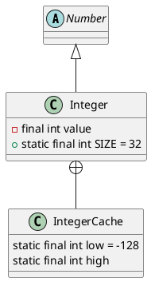

java.lang.Integer

## define

```plantuml
@startuml

abstract class Number
Number ^-- Integer

class Integer {
    - final int value
    + static final int SIZE = 32
}

Integer +-- IntegerCache

class IntegerCache {
    static final int low = -128
    static final int high
}

@enduml
```

## methos
```ts
defualt h = 127
-XX:AutoBoxCacheMax=<size>
```