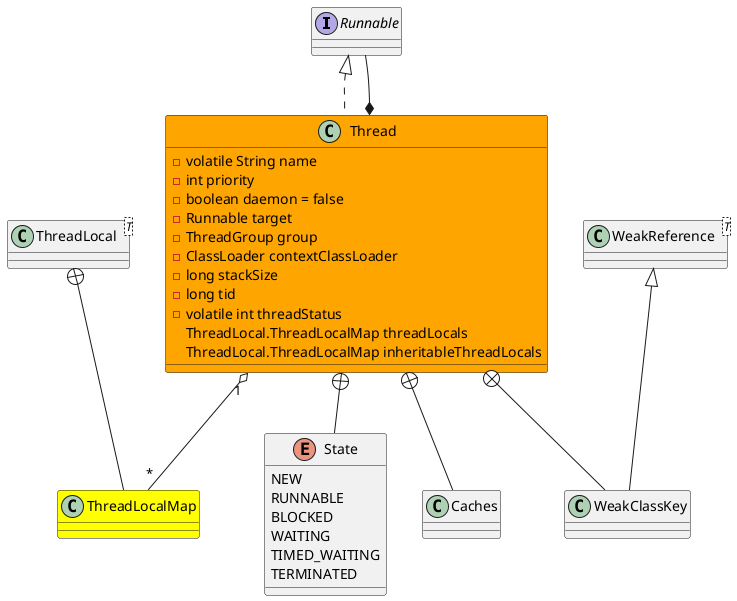
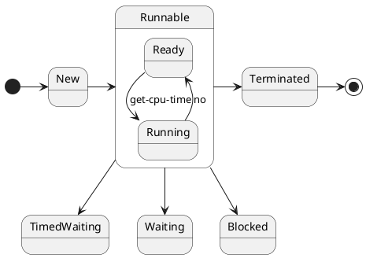

java.lang.Thread

* volatile
* synchronized
* final
* ClassLoader
* WeakReference, priority
* 核心方法
  * join
  * start
  * sleep
* 线程的同步与异步 任务是否在同一个线程执行
* 线程的阻塞与非阻塞 异步执行任务时，线程是不是会**阻塞**等待任务结果，还是执行后面逻辑

## define
* 线程字段
  * 名称
  * 优先级
  * 守护线程
  * 线程组
  * 上下文类加载器
  * 访问控制上下文
  * 线程初始记录
  * 线程本地Map
  * 继承的线程本地Map
  * 栈大小
  * 线程ID tid
  * 线程状态

## thread state
线程状态：新建、可运行（就绪、正在运行）、阻塞、等待、超时等待、终止

