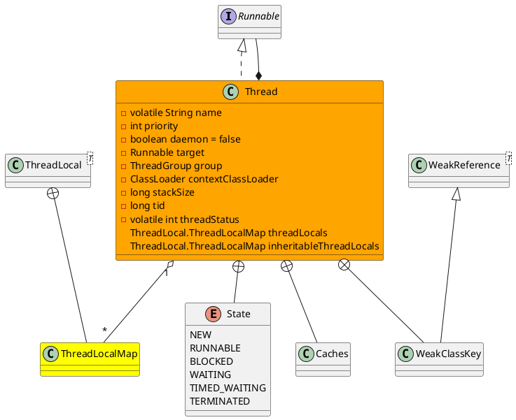
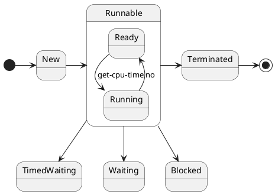

java.lang.Thread

* volatile
* synchronized
* final
* ClassLoader
* WeakReference, priority
* 核心方法
  * join
  * start
  * sleep

## define

```plantuml
@startuml

interface Runnable
Runnable ^.. Thread

'''''''''''''''''''''''''Thread''''''''''''''''''''''''''''
class Thread #orange {
    - volatile String name
    - int priority
    - boolean daemon = false
    - Runnable target
    - ThreadGroup group
    - ClassLoader contextClassLoader
    - long stackSize
    - long tid
    - volatile int threadStatus
    ThreadLocal.ThreadLocalMap threadLocals
    ThreadLocal.ThreadLocalMap inheritableThreadLocals
}

Thread *-- Runnable
Thread "1" o-- "*" ThreadLocalMap

'''''''''''''''''''''''''ThreadLocal''''''''''''''''''''''''''''
class ThreadLocal<T>
class ThreadLocalMap #yellow
ThreadLocal +-- ThreadLocalMap

enum State {
    NEW
    RUNNABLE
    BLOCKED
    WAITING
    TIMED_WAITING
    TERMINATED
}
Thread +-- State

'''''''''''''''''''''''''WeakClassKey''''''''''''''''''''''''''''
Thread +-- WeakClassKey

class WeakReference<T>
class WeakClassKey
WeakReference ^-- WeakClassKey

'''''''''''''''''''''''''Caches''''''''''''''''''''''''''''
Thread +-- Caches
class Caches    
@enduml
```

## thread state

```plantuml
@startuml

[*] -right-> New

New -right-> Runnable

state Runnable {
  Ready --> Running : get-cpu-time
  Running --> Ready : no
}

Runnable --> TimedWaiting
Runnable --> Waiting
Runnable --> Blocked

Runnable -right-> Terminated
Terminated -right-> [*]

@enduml
```
