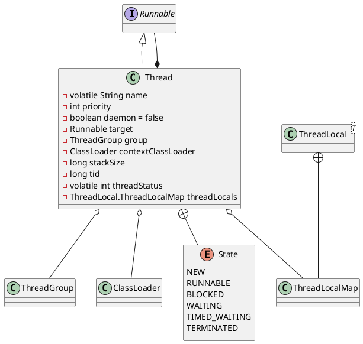
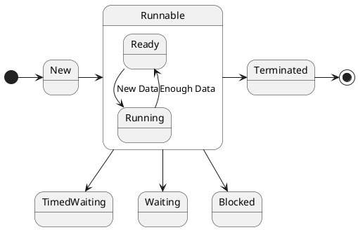

java.lang.Thread

## define

```plantuml
@startuml

interface Runnable
Runnable ^.. Thread

class Thread {
    - volatile String name
    - int priority
    - boolean daemon = false
    - Runnable target
    - ThreadGroup group
    - ClassLoader contextClassLoader
    - long stackSize
    - long tid
    - volatile int threadStatus
    - ThreadLocal.ThreadLocalMap threadLocals
}

Thread *-- Runnable
Thread o-- ThreadGroup
Thread o-- ClassLoader
Thread o-- ThreadLocalMap

class ThreadLocal<T>
class ThreadLocalMap
ThreadLocal +-- ThreadLocalMap

enum State {
    NEW
    RUNNABLE
    BLOCKED
    WAITING
    TIMED_WAITING
    TERMINATED
}
Thread +-- State
    
@enduml
```

### thread state

```plantuml
@startuml

[*] -right-> New

New -right-> Runnable

state Runnable {
  Ready --> Running : New Data
  Running --> Ready : Enough Data
}

Runnable --> TimedWaiting
Runnable --> Waiting
Runnable --> Blocked

Runnable -right-> Terminated
Terminated -right-> [*]

@enduml
```