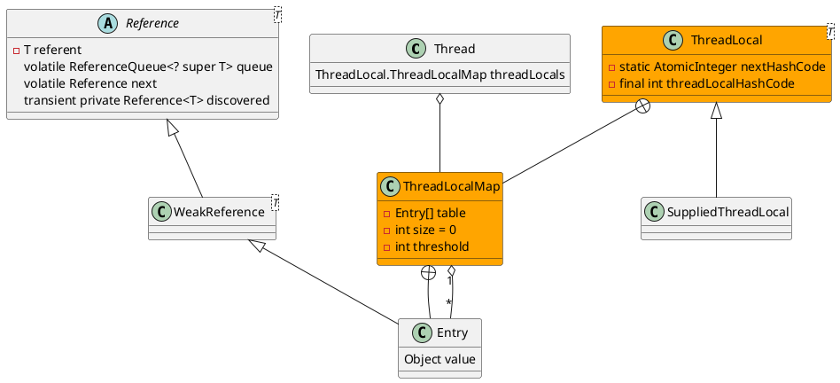

java.lang.ThreadLocal

## define
* AtomicInteger.getAndAdd()
* WeakReference
* final


threadLocal内存泄漏的根源是：由于ThreadLocalMap的生命周期跟Thread一样长，如果没有手动删除对应key就会导致内存泄漏，而不是因为弱引用。

## methods
### get()
```
public T get() {
    // 当前线程
    Thread t = Thread.currentThread();
    // 线程本地映射
    ThreadLocalMap map = getMap(t);
    if (map != null) {
        ThreadLocalMap.Entry e = map.getEntry(this);
        if (e != null) {
            @SuppressWarnings("unchecked")
            T result = (T)e.value;
            return result;
        }
    }
    return setInitialValue();
}
```

## expungeStaleEntry(int staleSlot)