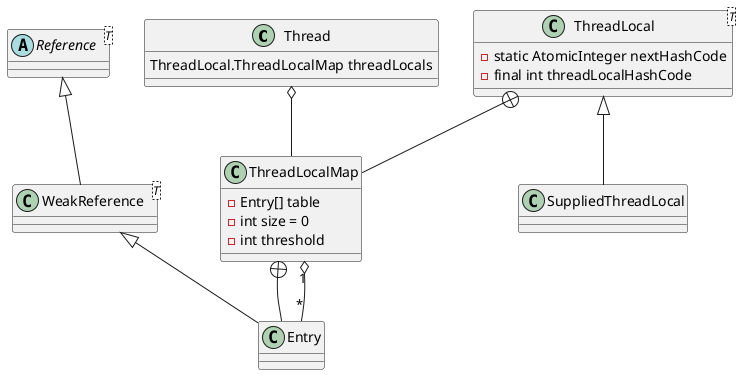

java.lang.ThreadLocal

## define

```plantuml
@startuml

class Thread {
    ThreadLocal.ThreadLocalMap threadLocals
}
Thread o-- ThreadLocalMap

class ThreadLocal<T> {
    - static AtomicInteger nextHashCode
    - final int threadLocalHashCode
}

ThreadLocal +-- ThreadLocalMap
ThreadLocal ^-- SuppliedThreadLocal

class ThreadLocalMap {
    - Entry[] table
    - int size = 0
    - int threshold
}

ThreadLocalMap +-- Entry
ThreadLocalMap "1" o-- "*" Entry


abstract class Reference<T>
class WeakReference<T>
class Entry

Reference ^-- WeakReference
WeakReference ^-- Entry

@enduml
```