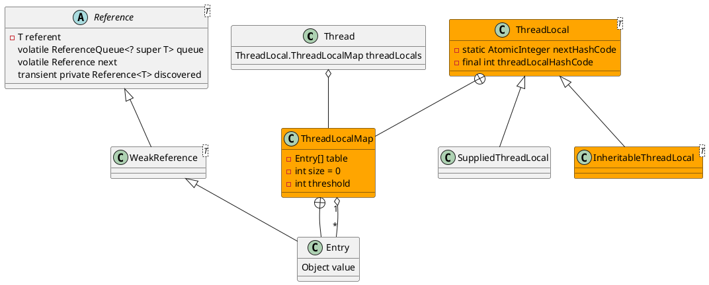

java.lang.ThreadLocal

解决哈希冲突方法
* 开放地址法
  * 线性探测，顺序查看下一个单元，知道找出一个空闲单元或遍历全表；ThreadLocalMap
  * 平方探测
  * 再散列法
  * 伪随机序列法
* 拉链法（链接法）

## pacakge
```
ThreadLocal (java.lang)
    InheritableThreadLocal (java.lang)
    NamedThreadLocal (org.springframework.core)
    ThreadLocalBoolean (org.jboss.netty.util.internal)
```

## define
* AtomicInteger.getAndAdd()
* WeakReference
* final


threadLocal内存泄漏的根源是：由于ThreadLocalMap的生命周期跟Thread一样长，如果没有手动删除对应key就会导致内存泄漏，而不是因为弱引用。

## methods
### get()
```
public T get() {
    // 当前线程
    Thread t = Thread.currentThread();
    // 线程本地映射
    ThreadLocalMap map = getMap(t);
    if (map != null) {
        ThreadLocalMap.Entry e = map.getEntry(this);
        if (e != null) {
            @SuppressWarnings("unchecked")
            T result = (T)e.value;
            return result;
        }
    }
    return setInitialValue();
}
```

## expungeStaleEntry(int staleSlot)