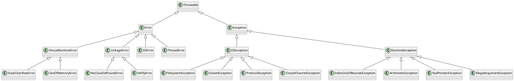

java.lang.Throwable

## hierarchy
```
Throwable (java.lang)
    Error (java.lang)
        VirtualMachineError (java.lang)
            StackOverflowError (java.lang)
            UnknownError (java.lang)
            InternalError (java.lang)
            OutOfMemoryError (java.lang)
                OutOfDirectMemoryError (io.netty.util.internal)
        LinkageError (java.lang)
            ClassCircularityError (java.lang)
            IncompatibleClassChangeError (java.lang)
                NoSuchFieldError (java.lang)
                InstantiationError (java.lang)
                NoSuchMethodError (java.lang)
                IllegalAccessError (java.lang)
                AbstractMethodError (java.lang)
            BootstrapMethodError (java.lang)
            ClassFormatError (java.lang)
            UnsatisfiedLinkError (java.lang)
            NoClassDefFoundError (java.lang)
            ExceptionInInitializerError (java.lang)
            VerifyError (java.lang)
        IOError (java.io)
        ThreadDeath (java.lang)
    Exception (java.lang)
        ActivationException (java.rmi.activation)
        ReflectiveOperationException (java.lang)
        InterruptedException (java.lang)
        SQLException (java.sql)
        IOException (java.io)
            FileLockInterruptionException (java.nio.channels)
            EOFException (java.io)
            FileSystemException (java.nio.file)
            RemoteException (java.rmi)
            SocketException (java.net)
            ProtocolException (java.net)
            ClosedChannelException (java.nio.channels)
            CharConversionException (java.io)
            UnsupportedEncodingException (java.io)
            UnknownServiceException (java.net)
            InterruptedIOException (java.io)
            ObjectStreamException (java.io)
        RuntimeException (java.lang)
            IndexOutOfBoundsException (java.lang)
            ArithmeticException (java.lang)
            ClassCastException (java.lang)
            ConcurrentModificationException (java.util)
            SecurityException (java.lang)
            ArrayStoreException (java.lang)
            CompletionException (java.util.concurrent)
            DateTimeException (java.time)
            NullPointerException (java.lang)
            IllegalStateException (java.lang)
            BufferOverflowException (java.nio)
            FileSystemNotFoundException (java.nio.file)
            IllegalArgumentException (java.lang)
            BufferUnderflowException (java.nio)
        TimeoutException (java.util.concurrent)
        ParseException (java.text)
```

## define


