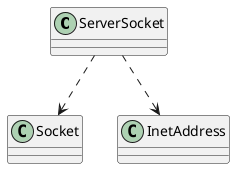

java.net.ServerSocket

## define



## methods
### ServerSocket
```java

public ServerSocket(int port, int backlog, InetAddress bindAddr) throws IOException {
        setImpl();
        if (port < 0 || port > 0xFFFF)
            throw new IllegalArgumentException(
                       "Port value out of range: " + port);
        if (backlog < 1)
          backlog = 50;
        try {
            bind(new InetSocketAddress(bindAddr, port), backlog);
        } catch(SecurityException e) {
            close();
            throw e;
        } catch(IOException e) {
            close();
            throw e;
        }
    }
```

* public void bind(SocketAddress endpoint, int backlog)