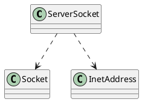

java.net.ServerSocket

## define

```plantuml
@startuml

class ServerSocket


ServerSocket ..> Socket
ServerSocket ..>  InetAddress
class Socket

@enduml
```

## methods
* public void bind(SocketAddress endpoint, int backlog)