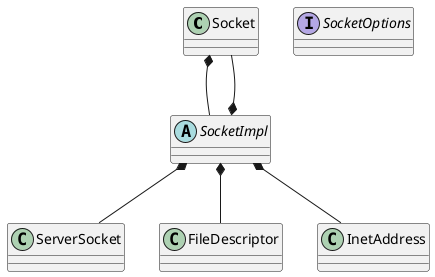

java.net.Socket

## define

```plantuml
@startuml

class Socket
Socket *-- SocketImpl

interface SocketOptions
abstract class SocketImpl

SocketImpl *-- ServerSocket
SocketImpl *-- Socket

SocketImpl *-- FileDescriptor
SocketImpl *-- InetAddress

@enduml
```