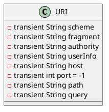

java.net.URI

## define

```plantuml
@startuml

class URI {
    - transient String scheme
    - transient String fragment
    - transient String authority
    - transient String userInfo
    - transient String host
    - transient int port = -1
    - transient String path
    - transient String query
}

@enduml
```